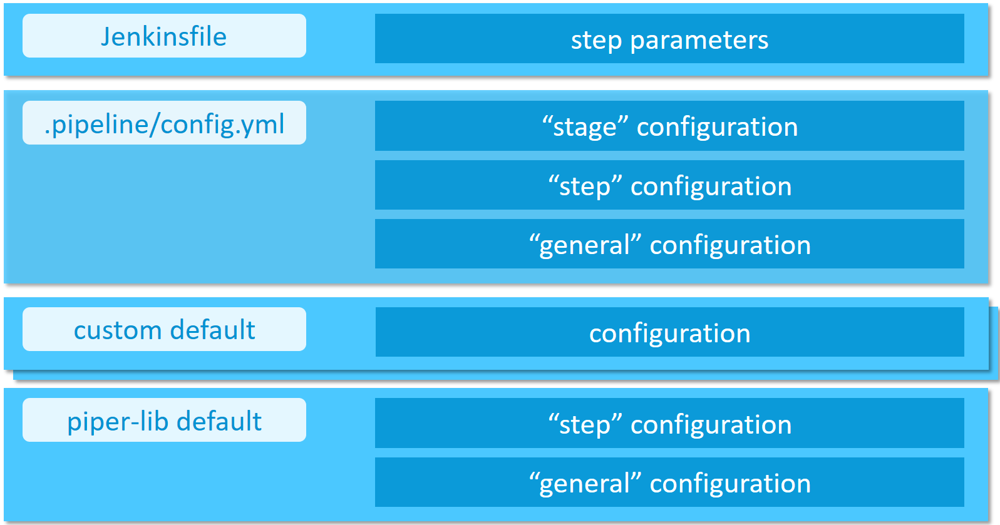

# Configuration

Configure your project through a yml-file, which is located at `.pipeline/config.yml` in the **master branch** of your source code repository.

Your configuration inherits from the default configuration located at [https://github.com/SAP/jenkins-library/blob/master/resources/default_pipeline_environment.yml](https://github.com/SAP/jenkins-library/blob/master/resources/default_pipeline_environment.yml).

!!! caution "Adding custom parameters"
    Please note that adding custom parameters to the configuration is at your own risk.
    We may introduce new parameters at any time which may clash with your custom parameters.

Configuration of the project "Piper" steps, as well as project "Piper" templates, can be done in a hierarchical manner.

1. Directly passed step parameters will always take precedence over other configuration values and defaults
1. Stage configuration parameters define a Jenkins pipeline stage-dependent set of parameters (e.g. deployment options for the `Acceptance` stage)
1. Step configuration defines how steps behave in general (e.g. step `cloudFoundryDeploy`)
1. General configuration parameters define parameters which are available across step boundaries
1. Custom default configuration provided by the user through a reference in the `customDefaults` parameter of the project configuration
1. Default configuration comes with the project "Piper" library and is always available



## Collecting telemetry data

To improve this Jenkins library, we are collecting telemetry data.
Data is sent using [`com.sap.piper.pushToSWA`](https://github.com/SAP/jenkins-library/blob/master/src/com/sap/piper/Utils.groovy)

Following data (non-personal) is collected for example:

* Hashed job url, e.g. `4944f745e03f5f79daf0001eec9276ce351d3035` hash calculation is done in your Jenkins server and no original values are transmitted
* Name of library step which has been executed, like e.g. `artifactSetVersion`
* Certain parameters of the executed steps, e.g. `buildTool=maven`

**We store the telemetry data for no longer than 6 months on premises of SAP SE.**

!!! note "Disable collection of telemetry data"
    If you do not want to send telemetry data you can easily deactivate this.

    This is done with either of the following two ways:

    1. General deactivation in your `.pipeline/config.yml` file by setting the configuration parameter `general -> collectTelemetryData: false` (default setting can be found in the [library defaults](https://github.com/SAP/jenkins-library/blob/master/resources/default_pipeline_environment.yml)).

        **Please note: this will only take effect in all steps if you run `setupCommonPipelineEnvironment` at the beginning of your pipeline**

    2. Individual deactivation per step by passing the parameter `collectTelemetryData: false`, like e.g. `setVersion script:this, collectTelemetryData: false`

## Example configuration

```yaml
general:
  gitSshKeyCredentialsId: GitHub_Test_SSH

steps:
  cloudFoundryDeploy:
    deployTool: 'cf_native'
    cloudFoundry:
      org: 'testOrg'
      space: 'testSpace'
      credentialsId: 'MY_CF_CREDENTIALSID_IN_JENKINS'
  newmanExecute:
    newmanCollection: 'myNewmanCollection.file'
    newmanEnvironment: 'myNewmanEnvironment'
    newmanGlobals: 'myNewmanGlobals'
```

## Sending log data to the SAP Alert Notification service for SAP BTP

The SAP Alert Notification service for SAP BTP allows users to define
certain delivery channels, for example, e-mail or triggering of HTTP
requests, to receive notifications from pipeline events. If the alert
notification service service-key is properly configured in "Piper", any "Piper"
step implemented in golang will send log data to the alert notification
service backend.

The SAP Alert Notification service event properties are defined depending on the
log entry content as follows:

- `eventType`: the type of event type (defaults to 'Piper', but can be
  overwritten with the event template)
- `eventTimestamp`: the time of the log entry
- `severity` and `category`: the event severity and the event category
  depends on the log level:

  | log level | severity | category |
  |-----------|----------|----------|
  | info | INFO | NOTICE |
  | debug | INFO | NOTICE |
  | warn | WARNING | ALERT |
  | error | ERROR | EXCEPTION |
  | fatal | FATAL | EXCEPTION |
  | panic | FATAL | EXCEPTION |

- `subject`: short description of the event (defaults to the step name, but
  can be overwritten with the event template)
- `body`: the log message
- `priority`: (optional) an integer number in the range [1:1000] (not set by
  "Piper", but can be set with the event template)
- `tags`: optional key-value pairs. The following are set by "Piper":
  - `logLevel`: the "Piper" log level
  - `ans:correlationId`: a unique correlation ID of the pipeline run
    (defaults to the URL of that pipeline run, but can be overwritten with the
    event template)
  - `ans:sourceEventId`: also set to the "Piper" correlation ID (can also be
    overwritten with the event template)
- `resource`: the following default properties are set by "Piper":
  - `resourceType`: resource type identifier (defaults to 'Pipeline', but
    can be overwritten with the event template)
  - `resourceName`: unique resource name (defaults to 'Pipeline', can be
    overwritten with the event template)
  - `resourceInstance`: (optional) resource instance identifier (not set by
    "Piper", can be set with the event template)

The following event properties cannot be set and are instead set by the SAP
Alert Notification service:
`region`, `regionType`, `resource.globalAccount`, `resource.subAccount` and
`resource.resourceGroup`

For more information and an example of the structure of an alert
notification service event, see
[SAP Alert Notification Service Events](https://help.sap.com/viewer/5967a369d4b74f7a9c2b91f5df8e6ab6/Cloud/en-US/eaaa37e6ff62486ebb849507dc33abc6.html)
on SAP Help Portal.

### SAP Alert Notification service configuration

The SAP Alert Notification service service-key needs to be present in the
environment, where the "Piper" binary is run. The environment variable used
is: `PIPER_ansServiceKey`

If Jenkins is used to run "Piper", you can use the Jenkins credential store
to store the alert notification service service-key as a "Secret Text"
credential. Provide the credential id in the configuration file as follows:

```yaml
hooks:
  ans:
    serviceKeyCredentialsId: 'my_ANS_Service_Key'
```

You can also create an event template in JSON format to overwrite or add
certain event details. There are two ways to do this:

1. Provide an event template file in JSON format and set the
   `eventTemplateFilePath` parameter in the config file as follows:

   ```yaml
   hooks:
     ans:
       eventTemplateFilePath: './path/to/my/eventTemplate.json'
   ```

2. Provide the JSON string directly in the environment where the "Piper"
   binary is run. The environment variable used in this case is:
   `PIPER_ansEventTemplate`. For example in unix:

    ```bash
    export PIPER_ansEventTemplate='{"priority": 999}'
    ```

## Collecting telemetry and logging data for Splunk

Splunk gives the ability to analyze any kind of logging information and to visualize the retrieved information in dashboards.
To do so, we support sending telemetry information as well as logging information in case of a failed step to a Splunk Http Event Collector (HEC) endpoint.

The following data will be sent to the endpoint if activated:

* Hashed pipeline URL
* Hashed Build URL
* StageName
* StepName
* ExitCode
* Duration  (of each step)
* ErrorCode
* ErrorCategory
* CorrelationID (not hashed)
* CommitHash (Head commit hash of current build.)
* Branch
* GitOwner
* GitRepository

The information will be sent to the specified Splunk endpoint in the config file. By default, the Splunk mechanism is
deactivated and gets only activated if you add the following to your config:

```yaml
general:
  gitSshKeyCredentialsId: GitHub_Test_SSH

steps:
  cloudFoundryDeploy:
    deployTool: 'cf_native'
    cloudFoundry:
      org: 'testOrg'
      space: 'testSpace'
      credentialsId: 'MY_CF_CREDENTIALSID_IN_JENKINS'
hooks:
  splunk:
    dsn: 'YOUR SPLUNK HEC ENDPOINT'
    token: 'YOURTOKEN'
    index: 'SPLUNK INDEX'
    sendLogs: true
```

`sendLogs` is a boolean, if set to true, the Splunk hook will send the collected logs in case of a failure of the step.
If no failure occurred, no logs will be sent.

### How does the sent data look alike

In case of a failure, we send the collected messages in the field `messages` and the telemetry information in `telemetry`. By default, piper sends the log messages in batches. The default length for the messages is `1000`. As an example:
If you encounter an error in a step that created `5k` log messages, piper will send five messages containing the messages and the telemetry information.

```json
{
  "messages": [
    {
      "time": "2021-04-28T17:59:19.9376454Z",
      "message": "Project example pipeline exists...",
      "data": {
        "library": "",
        "stepName": "checkmarxExecuteScan"
      }
    }
  ],
  "telemetry": {
    "PipelineUrlHash": "73ece565feca07fa34330c2430af2b9f01ba5903",
    "BuildUrlHash": "ec0aada9cc310547ca2938d450f4a4c789dea886",
    "StageName": "",
    "StepName": "checkmarxExecuteScan",
    "ExitCode": "1",
    "Duration": "52118",
    "ErrorCode": "1",
    "ErrorCategory": "undefined",
    "CorrelationID": "https://example-jaasinstance.corp/job/myApp/job/microservice1/job/master/10/",
    "CommitHash": "961ed5cd98fb1e37415a91b46a5b9bdcef81b002",
    "Branch": "master",
    "GitOwner": "piper",
    "GitRepository": "piper-splunk"
  }
}
```

## Access to the configuration from custom scripts

Configuration is loaded into `commonPipelineEnvironment` during step [setupCommonPipelineEnvironment](steps/setupCommonPipelineEnvironment.md).

You can access the configuration values via `commonPipelineEnvironment.configuration` which will return you the complete configuration map.

Thus following access is for example possible (accessing `gitSshKeyCredentialsId` from `general` section):

```groovy
commonPipelineEnvironment.configuration.general.gitSshKeyCredentialsId
```

## Access to configuration in custom library steps

Within library steps the `ConfigurationHelper` object is used.

You can see its usage in all the Piper steps, for example [newmanExecute](https://github.com/SAP/jenkins-library/blob/master/vars/newmanExecute.groovy#L23).

## Custom default configuration

For projects that are composed of multiple repositories (microservices), it might be desired to provide custom default configurations.
To do that, create a YAML file which is accessible from your CI/CD environment and configure it in your project configuration.
For example, the custom default configuration can be stored in a GitHub repository and accessed via the "raw" URL:

```yaml
customDefaults: ['https://my.github.local/raw/someorg/custom-defaults/master/backend-service.yml']
general:
  ...
```

Note, the parameter `customDefaults` is required to be a list of strings and needs to be defined as a separate section of the project configuration.
In addition, the item order in the list implies the precedence, i.e., the last item of the customDefaults list has the highest precedence.

It is important to ensure that the HTTP response body is proper YAML, as the pipeline will attempt to parse it.

Anonymous read access to the `custom-defaults` repository is required.

The custom default configuration is merged with the project's `.pipeline/config.yml`.
Note, the project's config takes precedence, so you can override the custom default configuration in your project's local configuration.
This might be useful to provide a default value that needs to be changed only in some projects.
An overview of the configuration hierarchy is given at the beginning of this page.

If you have different types of projects, they might require different custom default configurations.
For example, you might not require all projects to have a certain code check (like Whitesource, etc.) active.
This can be achieved by having multiple YAML files in the _custom-defaults_ repository.
Configure the URL to the respective configuration file in the projects as described above.
