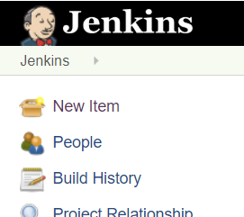
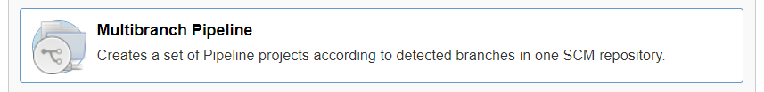
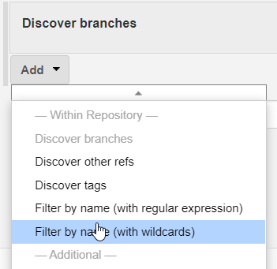
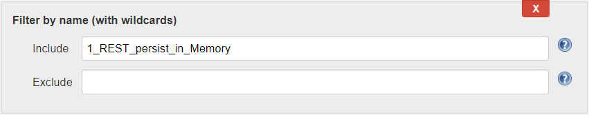
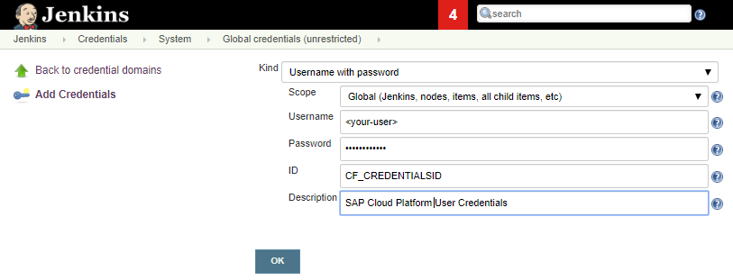
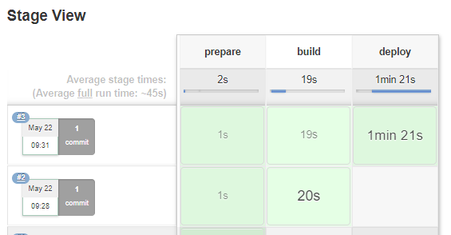

# Getting Started with Project "Piper"

Follow this guided tour to become familiar with the basics of using project "Piper".

The public sample application [cloud-cf-helloworld-nodejs][cloud-cf-helloworld-nodejs] will be enriched with a pipeline which syncs the sources, builds these as multitarget applications and deploys the result into a Cloud Foundry environment. The application contains a simple `nodejs` application. Deployed as web service, it serves static data.

**Recommendation:** We recommend to clone the sample application [cloud-cf-helloworld-nodejs][cloud-cf-helloworld-nodejs] and execute the instructions on your own repository. See **(Optional) Sample Application**.

The stated instructions assume the use of this application.

## Prerequisites

* You have installed a Linux system with at least 4 GB memory. **Note:** We have tested our samples on Ubuntu 16.04. On Microsoft Windows, you might face some issues.
* You have installed the newest version of Docker. See [Docker Community Edition](https://docs.docker.com/install/). **Note:** we have tested on Docker 18.09.6.
* Your system has access to [GitHub.com][github].

## Install your Jenkins

For an approach to setup a Jenkins build sever which fits the needs of the project "Piper" pipelines and steps please read the [Infrastructure Overview][resources-infrastructure].

## (Optional) Sample Application

!!! info "Choosing the best sample application"
    Depending on the type of project you're interested in, different sample applications might be interesting.
    For SAP Cloud SDK, please have a look at the [Address Manager](https://github.com/sap/cloud-s4-sdk-book) example application.

Copy the sources of the application into your own Git repository. While we will ask you to fork the application's repository into a **GitHub** space, you can use any version control system based on Git like **GitLab** or **plain git**. **Note:** A `public` GitHub repository is visible to the public. The configuration files may contain data you don't want to expose, so use a `private` repository.

1. Create an organization on GitHub, if you haven't any yet. See [Creating a new organization][github-create-org].
1. [Duplicate][github-duplicate-repo] the repository [cloud-cf-helloworld-nodejs][cloud-cf-helloworld-nodejs] into your GitHub organization. [Make this repository private][github-set-repo-visible]. **Note:** Forked public repositories cannot be made private.
1. Get an account and space in the Cloud Foundry environment. For the deployment of the application you need access to a space on the Cloud Foundry environment of the SAP Business Technology Platform (SAP BTP). If you haven't any yet, get a [Trial Account][sap-cp-trial].
1. Select the `1_REST_persist_in_Memory` branch of your [cloud-cf-helloworld-nodejs] fork. Other branches might work as well, but this one is tested.

## Create Your First Pipeline

1. Get your application repository in place.
1. Create a new file with the name `Jenkinsfile` in the root level of your repository and enter the following code:

   ```
   @Library('piper-lib-os') _
   node() {
       stage('prepare') {
           checkout scm
           setupCommonPipelineEnvironment script:this
       }
   }
   ```

   The "prepare" step synchronizes the repository and initializes the project specific settings. For more information about Jenkinsfiles and pipelines, see [Using a Jenkinsfile][jenkins-io-jenkinsfile].

1. Save your changes to your remote repository.

1. To set up a Jenkins job for your repository, open the Jenkins UI under `http://<jenkins-server-address>:<http-port>` and choose **New Item**. For more information, see the [Jenkins User Documentation][jenkins-io-documentation].

    

1. Provide a name for your new item (for example, *My First Pipeline*) and select **Multibranch Pipeline**.
    

    **Note:** The ready-made continuous delivery pipelines of project "Piper" must run as **Multibranch Pipeline**.

1. For **Branch Sources**, choose **Add source**, select **Git** as source repository.

    

1. For **Project Repository** in the **Git** section, enter the URL of your Git repository, for example `https://github.com/<your-org>/cloud-cf-helloworld-nodejs`. **Note:** If your repository is protected, you must provide your credentials in **Credentials**.

1. For **Discover branches**, choose **Add** and **Filter by name (with wildcards)**.

    

    A multibranch pipeline can execute different Jenkinsfiles for different branches. In this case, however, configure the pipeline of a single branch only.

1. For **Include** in the **Filter by name** section, enter the branch name `1_REST_persist_in_Memory`.

    

1. Choose **Save**. **Result:** Jenkins scans the repository for branches and filters them according to the specified **Includes**. If the branch is detected, it is built.

For additional information about multibranch pipelines, please refer to the [Jenkins documentation][jenkins-io-multibranch].

## Add a Build Step

1. In your `Jenkinsfile`, add the following code snippet:

   ```
   stage('build') {
       mtaBuild script: this
   }
   ```

The `mtaBuild` step calls a build tool to build a multitarget application (MTA). The tool consumes an MTA descriptor that contains the metadata of all entities which comprise an application or are used by one during deployment or runtime, and the dependencies between them. For more information about MTAs, see [sap.com][sap].

1. Create the MTA descriptor file with the name `mta.yaml` in the root level of the repository. Insert the following code:

   ```
   _schema-version: 2.1.0
   ID: com.sap.piper.node.hello.world
   version: 1.0.0
   description: A Hello World sample application
   provider: SAP Sample generator
   modules:
     - name: piper.node.hello.world
       type: nodejs
       path: .
   ```

1. Configure the step to build an MTA for the Cloud Foundry environment. Create the configuration file `.pipeline/config.yml` relative to the root level of the repository and insert the following content:

   ```
   general:
   steps:
     mtaBuild:
       buildTarget: 'CF'
   ```

   For additional information about the configuration, have a look at the [Common Configuration Guide][resources-configuration] and the [MTA build step documentation][resources-step-mtabuild].

1. Save your changes to your remote repository.

1. To run your pipeline, choose **Build Now** in the job UI. **Result:** The pipeline processed two stages, the "prepare" and the "build".

## Add a Deploy Step

1. In your `Jenkinsfile`, add the following code snippet:

   ```
   stage('deploy') {
       cloudFoundryDeploy script: this
   }
   ```

The `cloudFoundryDeploy`  step calls the Cloud Foundry command line client to deploy the built MTA into SAP BTP.

1. To configure the step to deploy into the Cloud Foundry environment, in your repository, open the `.pipeline/config.yml` and add the following content:

   ```
     cloudFoundryDeploy:
       deployTool: 'mtaDeployPlugin'
       deployType: 'standard'
       cloudFoundry:
         org: '<your-organisation>'
         space: '<your-space>'
         credentialsId: 'CF_CREDENTIALSID'
   ```

   **Note:** look after the indentation of the step within the YAML. Specify the `organisation` and `space` properties. For more information about the configuration, see the [Common Configuration Guide][resources-configuration] and [cloudFoundryDeploy][resources-step-cloudFoundryDeploy].
1. The key `CF_CREDENTIALSID` refers to a user-password credential you must create in Jenkins: In Jenkins, choose **Credentials** from the main menu and add a **Username with Password** entry.

    

1. Save the Credential

1. Save your changes to your remote repository.

1. To run your pipeline, choose **Build Now** in the job UI. **Result:** The pipeline processed the three stages "prepare", "build" and "deploy".

    

If your pipeline fails, compare its files to the final [Jenkinsfile][guidedtour-sample.jenkins], the [config.yml][guidedtour-sample.config], and the [mta.yaml][guidedtour-sample.mta]. **Note**: YAML files are surprisingly sensitive regarding indentation.

## Open Application

Your application has been deployed into your space in the Cloud Foundry space on SAP BTP. Login to SAP BTP and navigate into you space.   **Result:** Your space contains the application `piper.node.hello.world`, the state of the application is `Started`.

  

Open the application name to get into the `Application Overview`. Open the **Application Route** and add `/users` to the URL. **Result:** The application returns a list of user data.

## What's Next

You are now familiar with the basics of using project "Piper". Through the concept of pipeline as code, project "Piper" and Jenkins pipelines are extremely powerful. While Jenkins pipelines offer a full set of common programming features, project "Piper" adds SAP-specific flavors. Have a look at the different **Scenarios**  to understand how to easily integrate SAP systems with defaults.
Dive into the ready-made continuous delivery pipeline: the **General Purpose Pipeline** helps you to quickly build and deliver your apps.
Browse the steadily increasing list of features you can implement through the project "Piper" **Steps**.

The **Configuration** pattern supports simple pipelines that can be reused by multiple applications. To understand the principles of inheritance and customization, have a look at the the [configuration][resources-configuration] documentation.

[guidedtour-sample.config]:          samples/cloud-cf-helloworld-nodejs/pipeline/config.yml
[guidedtour-sample.jenkins]:         samples/cloud-cf-helloworld-nodejs/Jenkinsfile
[guidedtour-sample.mta]:             samples/cloud-cf-helloworld-nodejs/mta.yaml
[resources-configuration]:           configuration.md
[resources-infrastructure]:          infrastructure/overview.md
[resources-step-mtabuild]:           steps/mtaBuild.md
[resources-step-cloudFoundryDeploy]: steps/cloudFoundryDeploy.md

[sap]:                               https://www.sap.com
[sap-cp-trial]:                      https://account.hanatrial.ondemand.com

[cloud-cf-helloworld-nodejs]:        https://github.com/SAP/cloud-cf-helloworld-nodejs
[github]:                            https://github.com
[jenkins-io-documentation]:          https://jenkins.io/doc/
[jenkins-io-jenkinsfile]:            https://jenkins.io/doc/book/pipeline/jenkinsfile
[jenkins-io-multibranch]:            https://jenkins.io/doc/book/pipeline/multibranch/

[github-create-org]:                 https://help.github.com/en/articles/creating-a-new-organization-from-scratch
[github-duplicate-repo]:             https://help.github.com/en/articles/duplicating-a-repository
[github-set-repo-visible]:           https://help.github.com/en/articles/setting-repository-visibility
