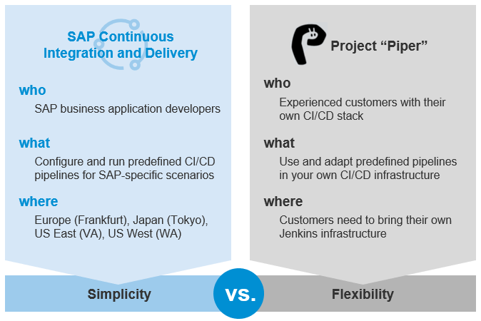

# Project "Piper" User Documentation

Easily set up continuous delivery in your software development using SAP technologies.
Continuous delivery is a method to develop software with short feedback cycles. It is applicable to projects both on the SAP Business Technology Platform (BTP) and on SAP on-premise platforms.
SAP implements tooling for continuous delivery in project "Piper".

## What you get

To get started with project "Piper", you can choose from the following offerings:

* A set of predefined pipelines that build, test, and deploy your code changes

  You can choose between the following use cases:
  
  * [ABAP Environment Pipeline](pipelines/abapEnvironment/introduction/)
  * [General Purpose Pipeline](stages/introduction/)
  * [A shared library][piper-library] that contains reusable step implementations, which enable you to customize the  preconfigured pipelines or to build your own ones, if necessary
  * A standalone [command line utility](cli) for Linux and a [GitHub Action](https://github.com/SAP/project-piper-action)
  **Note:** This version is still in early development and might not contain all features of the Jenkins library, yet. Feel free to use it and [provide feedback](https://github.com/SAP/jenkins-library/issues).

* A set of [Docker images][devops-docker-images] to easily set up a CI/CD environment using sophisticated life-cycle management

To find out which offering is right for you, we recommend you to look at the preconfigured pipelines first. In most cases,  you don't need to build your own pipelines - you can use the ready-made ones and adapt them according to your needs, if necessary.

If you don't need to care about the underlying infrastructure of your pipelines, you can use the [SAP Continuous Integration and Delivery](https://help.sap.com/docs/CONTINUOUS_DELIVERY) service on SAP BTP. It offers an easy, UI-guided way to set up continuous integration and delivery without hosting your own Jenkins instance.

 

The support infrastructure for SAP Continuous Integration and Delivery is provided by SAP according to the Service Level Agreements (SLAs). Project "Piper" offers community support using GitHub issues and pull requests. Users are free to contribute to the repository independently. See [Contributing](https://github.com/SAP/jenkins-library/blob/master/CONTRIBUTING.md).

For more information about the CI/CD solutions offered by SAP, see [SAP Solutions for Continuous Integration and Delivery](https://help.sap.com/docs/CICD_OVERVIEW/8cacec64ed854b2a88e9a0973e0f97a2/e9fa320181124fa9808d4446a1bf69dd.html).

To learn more about the continuous integration and delivery offerings by SAP, see [Continuous Integration and Delivery by SAP](https://help.sap.com/docs/CICD_OVERVIEW) and [Continuous Integration and Delivery by SAP Learning Journey](https://help.sap.com/learning-journeys/b76f0b2e5d534c449c1f3b0fa84ab697).

### The Best-Practice Way: Ready-Made Pipelines

Use the [general purpose pipeline](stages/introduction/) to build a standalone SAP BTP application or an SAP Cloud Application Programming Model application project. It supports various technologies and programming languages.

### The Do-It-Yourself Way: Customized Pipelines

The shared library contains building blocks for your own pipelines using Jenkins pipelines to implement best practice processes. For more information, see the **Scenarios** section from the navigation pane.

The best practice pipelines are based on the general concepts of [Pipelines as Code, as introduced in Jenkins 2][jenkins-doc-pipelines].
This way, you can optimize your pipelines with the help of the Jenkins community.

You can run the best practice Jenkins pipelines out-of-the-box, use them for project-specific adaptations, or create your own pipelines from scratch using the shared library.

For an example, see the [Build and Deploy SAPUI5 or SAP Fiori Applications on SAP Business Technology Platform (SAP BTP) with Jenkins][piper-library-scenario] scenario.

#### Extensibility

For the vast majority of _standard_ projects, the features of the ready-made pipelines should be enough to implement [Continuous Delivery](https://martinfowler.com/bliki/ContinuousDelivery.html) with little effort in a best-practice compliant way.
If you require more flexibility, our documentation on [Extensibility][piper-doc-extensibility] discusses available options.

#### API

All steps (`vars` and `resources` directory) are intended to be used by Pipelines and are considered API.
All the classes / groovy-scripts contained in the `src` folder are by default not part of
the API and are subjected to change without prior notice. Types and methods annotated with
`@API` are considered to be API, used e.g. from other shared libraries. Changes to those
methods/types needs to be announced, discussed and agreed.

[piper-library]: https://github.com/SAP/jenkins-library
[devops-docker-images]: https://github.com/SAP/devops-docker-images
[piper-library-scenario]: scenarios/ui5-sap-cp/Readme/
[piper-doc-extensibility]: extensibility
[jenkins-doc-pipelines]: https://jenkins.io/solutions/pipeline
