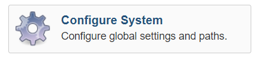
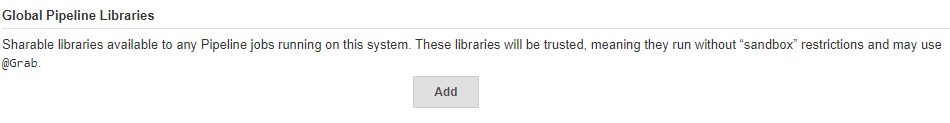
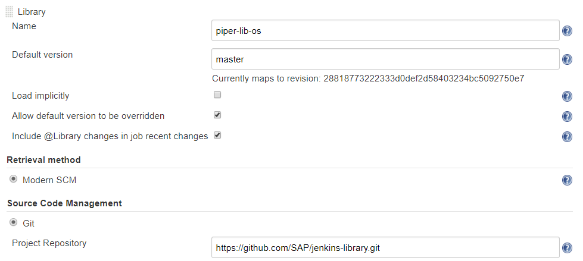

# Custom Jenkins Setup

## Requirements

* You have installed Java Runtime Environment 8.
* You have installed Jenkins v 2.60.3 or higher running on Linux. We've tested with debian-stretch.
* A Jenkins user with administration rights.
* Your Jenkins instance has access to [github.com][github].

## Docker

Most of the tools project "Piper" uses to build, test, and deploy your application are available as out-of-the-box Docker images. You don't need to manually install them on your Jenkins server or Jenkins nodes, nor care for updates. Instead, these are automatically pulled from *hub.docker.com*.

Install Docker if you haven't installed it, yet. To install the newest version of Docker, see [Docker Community Edition][docker-install].
**Note:** We've tested on Docker 18.09.6.

If your Jenkins server already runs as Docker container, make sure the tools container can run on the Docker host. Extend the Docker call in the following way:

```
docker run ...  -v /var/run/docker.sock:/var/run/docker.sock ...
```

## Plugins

Project "Piper" requires a set of plugins installed on your Jenkins server. This set may evolve in the future. Make sure that all plugins of the appropriate versions are installed.

## Shared Library

Shared libraries extending the Jenkins pipeline are defined within the Jenkins system configuration. A library is defined by a link to its source repository and an appropriate version identifier. To add the project "Piper"s library, execute the following steps:

1. Open the Jenkins UI under `http://<jenkins-server-address>:<http-port>`, login with administration privileges, and choose **Manage Jenkins > Configure System**.

    

1. Scroll down to section **Global Pipeline Libraries** and choose the **Add** button. A new library is created.

    

1. For **Library Name**, enter `piper-lib-os`.

1. For **Default Version**, enter the branch or tag you want to consume (e.g. `master` or `v0.1`).

1. For **Retrieval Method**, choose **Modern SCM**.

1. For **Source Code Management**, choose **Git**.

1. For **Project Repository**, enter the GitHub URL of the project Piper shared library `https://github.com/SAP/jenkins-library`.

    

1. Save your changes.

**Result:** The library is available as `piper-lib-os`. To use it by any pipeline, add the following line to its `Jenkinsfile`:

```groovy
@Library('piper-lib-os') _
```

When the pipeline is launched, Jenkins downloads the corresponding library as source and compiles it before the pipeline is processed.

## User Permission Issue

Your native Jenkins installation defines the user `jenkins` as a service user. If it doesn't exist, it is created. In this case, the user ID is the next free number determined by `/etc/passwd` - probably starting from `100`.
In contrast, the official [Jenkins Docker image][jenkins-docker-image] defines the user `jenkins` with the user ID `1000` as a service user inside the container.
So, the service user ID of your native Jenkins server most likely differs from the user ID of the official Jenkins Docker image.

This could have impacts.

Project "Piper" runs many pipeline steps as Docker images. If a Docker container is created, the Jenkins Docker plugin passes the Jenkins user and group ID as a process owner into the Docker container.
Binding a folder from the host machine into the container - used to exchange files between steps - results in file permission issues, if the user inside the container doesn't have rights for the folder on the host machine or vice versa.

Although you won't face this issue with images of project "Piper" , some 3rd-party Docker images follow this convention and expect to be executed under userid `1000`, like [node.js][dockerhub-node], which is used by a set of additional steps.

If you face such a [user permission issue][piper-issue-781], choose between the following options:

- Change the ID of your Jenkins service user to `1000`.

- [Create your own images][docker-getstarted] and solve the permission issues by removing the file system restrictions. Adjust the configuration accordingly, for example, adjust the `npmExecute` step of your project's YAML:

```
  npmExecute:
    dockerImage: 'my-node:8-stretch'
```

- Set up a namespace. The user permission [issue 781][piper-issue-781] of the project "Piper" repository describes how to set up a Linux kernel user namespace to prevent the mismatch of user IDs. **Note:** This solution is experimental and should be well-considered.

[github]: https://github.com
[docker-install]: https://docs.docker.com/install
[dockerhub-node]: https://hub.docker.com/_/node/
[docker-getstarted]: https://docs.docker.com/get-started/
[jenkins-docker-image]: https://github.com/jenkinsci/docker/
[piper-issue-781]: https://github.com/SAP/jenkins-library/issues/781
