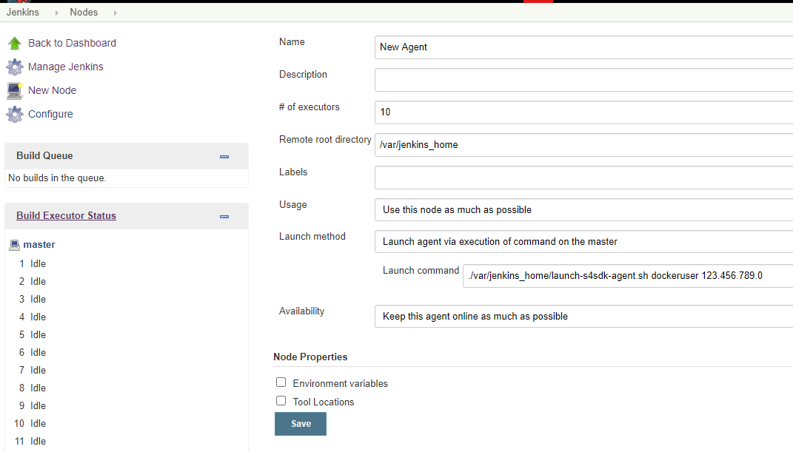
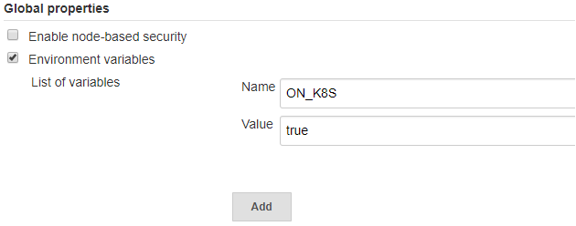

# Infrastructure

Besides SAP specific Jenkins library steps and out-of-the-box pipelines, project "Piper" offers also documentation and tooling to start the corresponding Jenkins server with all the configuration required to run project "Piper" pipelines.

The core of the Jenkins infrastructure tooling is a set of [Docker images][docker-images].
There is a main Docker image containing a preconfigured Jenkins and several tooling images used in the specific project "Piper" steps.

!!! info "Docker Hub rate limiting"
    Please be aware that Docker Hub as rate limiting active which might cause project "Piper" pipelines to fail.
    Refer to the [page dedicated to docker rate limiting for details and solutions][resources-docker-rate-limit].

The document and the linked resources explain the various ways of starting such a Jenkins server based on these Docker images.

## Cx Server (Recommended)

Cx Server is a life-cycle management tool to bootstrap a pre-configured Jenkins instance within minutes on your own (virtual) server.
It uses the Docker images mentioned above.
As it would be cumbersome to start the Docker image manually with all required parameters and sidecar images, this command line tool automates the bootstraping.

### Setting up a Jenkins master

For the following steps you will need a server or another machine which has Docker installed and configured.

To get started, initialize the Cx Server by using this `docker run` command:

```sh
docker run -it --rm -u $(id -u):$(id -g) -v "${PWD}":/cx-server/mount/ ppiper/cx-server-companion:latest init-cx-server
```

This creates a few files in your current working directory.
The shell script `cx-server` and the configuration file `server.cfg` are of special interest.

Now, you can start the Jenkins server by using the following command:

```sh
chmod +x ./cx-server
./cx-server start
```

For more information on the Cx Server and how to customize your Jenkins, have a look at the [Operations Guide for Cx Server][devops-docker-images-cxs-guide].

### Setting up Jenkins agents

With more and more qualities checked automatically in the pipeline, more and more resources are required to handle the workload.
This section shows how to scale the pipeline by adding [Jenkins build agents][build-agents].

However, before setting up agents please consider also other ways to scale the build infrastructure.
It might be an option to have only one Jenkins master with lots of resources (cpu cores, memory) per project or team.
This has the advantage of bringing more configuration flexibility and isolation for the individual teams but has the disadvantage that parts of the configuration have to be maintained twice.
Furthermore, having agents and thus network communication between the build servers increases the risk of failures.

To add an agent to the Jenkins master, please make sure to fulfil the following requirements similar to the ones for the Jenkins master:

- Access to a new server which runs on Linux
- Docker installed on this server

The connection between the master and the agents will be established via ssh.
As the Jenkins master runs in a Docker container, the ssh setup steps, such as creating and storing a private/public key pair or maintaining the konwn hosts file has to be done inside this container.

To execute these steps inside the container, execute the following command on the server where the Jenkins master is running:

```bash
docker exec -it cx-jenkins-master bash
```

Inside the container make sure to be able to access the server where the Jenkins agent should be started by running the following command. As user you should use a user which is able to execute `docker` commands, i.e. starting a docker container.

```bash
ssh <docker-user>@<host/ip>
```

To be able to access the agent via ssh with the command above you might need to generate a new ssh key with `ssh-keygen`, store it in the `.ssh` folder and register the public key on the agent server.
You might also need to add server’s fingerprint to the list of known hosts.
For more information around establishing a ssh connection please consult the [ssh documentation][ssh-documentation].

To setup a new Jenkins agent, open "Manage Jenkins" > "Manage Nodes" > "New Nodes" and create a new "Permanent Agent"

Please define `/var/jenkins_home` as "Remote root directory".
The launch method has to be "Launch agent via execution of command on the master" and the command should be:
`./var/jenkins_home/launch-jenkins-agent.sh <user> <host> [image]`.
User and host should equal the values you used above to test the ssh connection.

The following picture shows an example configuration.



## Kubernetes (Experimental)

Hosting Jenkins master and agents means that we bind the required resources to the purpose of executing builds.
There are good chances that, these resources stay idle for the most part of the day, i.e. if you have high peak loads.
Autoscaling of the infrastructure solves such a problem.
Instead of reserving the resources proactively, the pipeline creates the Jenkins agents dynamically on a Kubernetes cluster during the execution.
Once the agent completes the dedicated task, it is deleted and the resources are freed.
Project "Piper" supports running the pipeline as well as individual steps in a Kubernetes Cluster.
Please note that this feature is currently only experimental.

To setup the Jenkins master in Kubernetes you can use helm.
The documentation to install Jenkins using helm can be found [here][jenkins-helm].

To use the Jenkins image provided by project Piper, pass `ppiper/jenkins-master` as a value for the `Master.Image` command line argument while deploying Jenkins to Kubernetes.

The successfully completed deployment consists of a Jenkins pod with port 80 and 50000 exposed for HTTP and internal JNLP traffic respectively.
The deployment also creates two services each to listen to incoming HTTP traffic on port 80 and the internal JNLP traffic on port 50000.
Please note that in this example setup, the SSL/TLS termination happens at the load balancer, hence all the traffic between a load balancer and the Jenkins pod is unencrypted.

Project "Piper" needs an environment variable set in the Jenkins to run the workload in Kubernetes.
In order to set the environment variable, navigate to "Manage Jenkins" > "Configure System" > "Global Properties".
Add an environment variable ON_K8S and set the value to true:



Afterwards, you should be able to run project "Piper" pipelines in Kubernetes.

## Custom Jenkins

### On your own: Custom Jenkins Setup

If you use your own Jenkins installation, you need to care for the configuration that is specific to project "Piper".
This option should only be considered if you know why you need it, otherwise using the Cx Server life-cycle management makes your life much easier.
If you choose to go this path, follow the [Custom Jenkins Setup guide][resources-custom-jenkins].

[devops-docker-images-cxs-guide]:    https://github.com/SAP/devops-docker-cx-server/blob/master/docs/operations/cx-server-operations-guide.md
[docker-images]:                     https://hub.docker.com/u/ppiper
[resources-docker-rate-limit]:       docker-rate-limit.md
[resources-custom-jenkins]:          customjenkins.md
[build-agents]:                      https://wiki.jenkins.io/display/jenkins/distributed+builds
[ssh-documentation]:                 https://www.openssh.com/manual.html
[jenkins-helm]:                      https://github.com/helm/charts/tree/master/stable/jenkins
