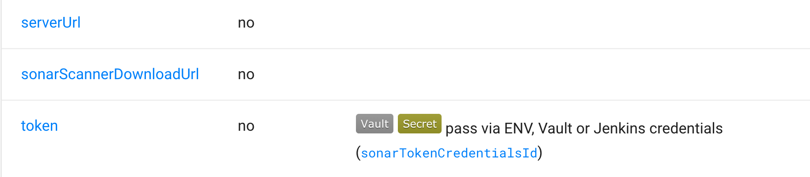
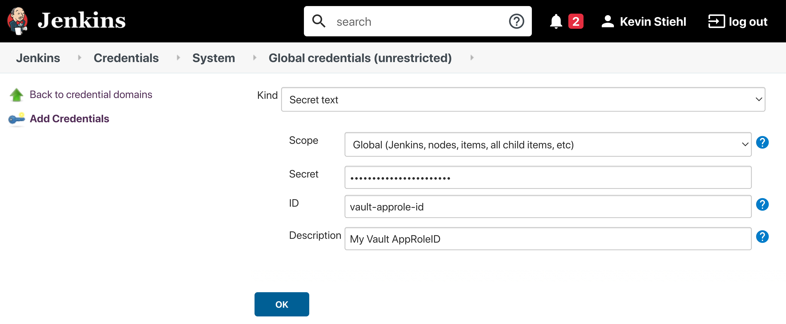

# Vault for Pipeline Secrets

Project "Piper" supports fetching your pipeline secrets directly from [Vault](https://www.hashicorp.com/products/vault).
Currently, Vault's key value engine is supported in version 1 and 2, although we recommend version 2 since it supports
the versioning of secrets

Parameters that support being fetched from Vault are marked with the Vault Label in the Step Documentation.



## Authenticating Piper to Vault

Piper currently supports Vault's `AppRole` and `Token` authentication. However, `AppRole` authentication is recommended
since Piper is able to regularly rotate the SecretID, which is not possible with a Token.

### AppRole Authentication

To authenticate against Vault, using [AppRole](https://www.vaultproject.io/docs/auth/approle) authentication you need to
do the following things

- Enable AppRole authentication in your Vault instance.
- After that you have
  to [create an AppRole Role](https://www.vaultproject.io/api-docs/auth/approle#create-update-approle) for Piper
- Assign the necessary policies to your newly created AppRole.
- Take the **AppRole ID** and create a Jenkins `Secret Text` credential.
- Take the **AppRole Secret ID** and create a Jenkins `Secret Text` credential.



### Token Authentication

First step to use Token authentication is
to [Create a Vault Token](https://www.vaultproject.io/api/auth/token#create-token)
In order to use a Vault token for authentication you need to store the Vault token inside your Jenkins instance as shown
below.


## Setup a Secret Store in Vault

The first step to store your pipeline secrets in Vault, is to enable a the
[Key-Value Engine](https://www.vaultproject.io/docs/secrets/kv/kv-v2). Then create a policy which grants read access to
the key value engine.


## Pipeline Configuration

For pipelines to actually use the secrets stored in Vault you need to adjust your `config.yml`:

```yml
general:
  ...
  vaultServerUrl: '<YOUR_VAULT_SERVER_URL>'
  vaultNamespace: '<YOUR_NAMESPACE_NAME>' # if you are not using vault's namespace feature you can remove this line
  vaultPath: 'kv/my-pipeline' # the path under which your jenkins secrets are stored
  ...
```

To authenticate you need to provide `PIPER_vaultAppRoleID` and `PIPER_vaultAppRoleSecretID` if you use app role authentication or `PIPER_vaultToken` if you use token authentication.

!!! note "Jenkins"
    When running a step via the Jenkins library you can use Jenkins credentials for pass this values. Use `vaultAppRoleTokenCredentialsId` and `vaultAppRoleSecretTokenCredentialsId` or `vaultTokenCredentialsId` in your `config.yml`.

## Configuring the Secret Lookup

When Piper is configured to lookup secrets in Vault, there are some aspects that need to be considered.

### Overwriting of Parameters

Whenever a parameter is provided via `config.yml` or passed to the CLI it gets overwritten when a secret is found in
Vault. To disable overriding parameters put a `vaultDisableOverwrite: true` on `Step` `Stage` or `General` Section in
your config.

```yaml
general:
  ...
  vaultDisableOverwrite: true
  ...
steps:
  executeBuild:
    vaultDisableOverwrite: false
    ...
```

### Skipping Vault Secret Lookup

It is also possible to skip Vault for `Steps`, `Stages` or in `General` by using the `skipVault` config parameter as
shown below.

```yaml
...
steps:
  executeBuild:
    skipVault: true   # Skip Vault Secret Lookup for this step
```

## Using Vault for general purpose and test credentials

Vault can be used with piper to fetch any credentials, e.g. when they need to be appended to custom piper extensions or when they need to be appended to test command. The configuration for Vault general purpose credentials can be added to **any** piper golang-based step. The configuration has to be done as follows:

```yaml
general:
  < your Vault configuration > # see above
...
steps:
  < piper go step >:
    vaultCredentialPath: 'myStepCredentials'
    vaultCredentialKeys: ['myAppId', 'myAppSecret']
```

In case if you want to retrieve secrets from multiple vault folders, pass several paths with keys:

```yaml
general:
  < your Vault configuration > # see above
...
steps:
  < piper go step >:
    vaultCredentialPath: ['myStepCredentials1', 'myStepCredentials2']
    vaultCredentialKeys: [['myAppId1', 'myAppSecret1'], ['myAppId2', 'myAppSecret2']]
```

The `vaultCredentialPath` parameter is the endpoint of your credential path in Vault. Depending on your _general_ config, the lookup for the credential IDs will be done in the following order respectively locations. The first path with found general purpose credentials will be used.

1. `<vaultPath>/<vaultCredentialPath>`
2. `<vaultBasePath>/<vaultPipelineName>/<vaultCredentialPath>`
3. `<vaultBasePath>/GROUP-SECRETS/<vaultCredentialPath>`

The `vaultCredentialKeys`parameter is a list of credential IDs. The secret value of the credential will be exposed as an environment variable prefixed by "PIPER_VAULTCREDENTIAL_" and transformed to a valid variable name. For a credential ID named `myAppId` the forwarded environment variable to the step will be `PIPER_VAULTCREDENTIAL_MYAPPID` containing the secret. The Base64 encoded secret value will be exposed as environment variable to the step as  `PIPER_VAULTCREDENTIAL_MYAPPID_BASE64`. Hyphens will be replaced by underscores and other non-alphanumeric characters will be removed.

!!! hint "Using a custom prefix for credentials"
    By default the prefix for credentials is `PIPER_VAULTCREDENTIAL_`.

    It is possible to use a custom prefix by setting for example `vaultCredentialEnvPrefix: MY_CUSTOM_PREFIX` in your configuration.
    With this above credential ID named `myAppId` will be populated into an environment variable with the name `MY_CUSTOM_PREFIX_MYAPPID`.

    In case you want to use specific prefix for secrets retrieved from different vault folders, pass multiple prefixes as
    `vaultCredentialEnvPrefix: ['MY_CUSTOM_PREFIX_1', 'MY_CUSTOM_PREFIX_2']`.
    With this above credential ID named `myAppId1` will be populated into an environment variable with the name `MY_CUSTOM_PREFIX_1_MYAPPID1` and `myAppId2` will be populated into an environment variable with name `MY_CUSTOM_PREFIX_2_MYAPPID2`

Extended logging for Vault secret fetching (e.g. found credentials and environment variable names) can be activated via `verbose: true` configuration.

## Using Vault for test credentials (Deprecated : use general purpose and test credentials as above)

Vault can be used with piper to fetch any credentials, e.g. when they need to be appended to test command. The configuration for Vault test credentials can be added to **any** piper golang-based step. The configuration has to be done as follows:

```yaml
general:
  < your Vault configuration > # see above
...
steps:
  < piper go step >:
    vaultTestCredentialPath: 'myTestStepCrecetials'
    vaultTestCredentialKeys: ['myAppId', 'myAppSecret']
```

The `vaultTestCredentialPath` parameter is the endpoint of your credential path in vault. Depending on your _general_ config, the lookup for the credential IDs will be done in the following order respectively locations. The first path with found test credentials will be used.

1. `<vaultPath>/<vaultTestCredentialPath>`
2. `<vaultBasePath>/<vaultPipelineName>/<vaultTestCredentialPath>`
3. `<vaultBasePath>/GROUP-SECRETS/<vaultTestCredentialPath>`

The `vaultTestCredentialKeys`parameter is a list of credential IDs. The secret value of the credential will be exposed as an environment variable prefixed by "PIPER_TESTCREDENTIAL_" and transformed to a valid variable name. For a credential ID named `myAppId` the forwarded environment variable to the step will be `PIPER_TESTCREDENTIAL_MYAPPID` containing the secret. Hyphens will be replaced by underscores and other non-alphanumeric characters will be removed.

!!! hint "Using a custom prefix for test credentials"
    By default the prefix for test credentials is `PIPER_TESTCREDENTIAL_`.

    It is possible to use a custom prefix by setting for example `vaultTestCredentialEnvPrefix: MY_CUSTOM_PREFIX_` in your configuration.
    With this above credential ID named `myAppId` will be populated into an environment variable with the name `MY_CUSTOM_PREFIX_MYAPPID`.

Extended logging for Vault secret fetching (e.g. found credentials and environment variable names) can be activated via `verbose: true` configuration.
