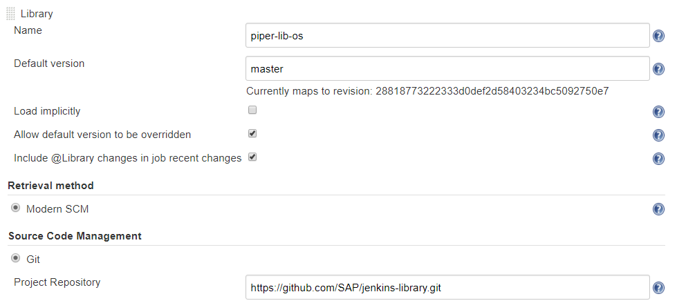

# My own Jenkins

**Note:** This guide is not sufficient yet, to setup a Jenkins for project "Piper".

## Requirements

* Java Runtime Environment 8
* Installation of Jenkins v 2.60.3 or higher running on Linux. We tested with debian-stretch.
* Jenkins Plugins installed as described in the [Required Plugin][piper-library-pages-plugins] section.
* A Jenkins user with administration privileges.
* The Jenkins instance has access to [github.com][github].

## Download and Installation

To setup the shared library, you need to perform the following steps:

1. Login to your Jenkins instance with administration privileges.
1. Open the system configuration page (*Manage Jenkins > Configure System*).
1. Scroll down to section *Global Pipeline Libraries* and add a new Library by clicking the *Add* button.
    1. set *Library Name* to `piper-lib-os`
    1. set *Default Version* to the branch or tag you want to consume (e.g. `master` or `v0.1`)
    1. set *Retrieval Method* to `Modern SCM`
    1. set *Source Code Management* to `Git`
    1. set *Project Repository* to `https://github.com/SAP/jenkins-library`
1. Save changes



Now the library is available as `piper-lib-os` and can be used in any
`Jenkinsfile` by adding this line:

```groovy
@Library('piper-lib-os') _
```

Jenkins will download the library during execution of the `Jenkinsfile`.

[github]: https://github.com
[piper-library]: https://github.com/SAP/jenkins-library
[devops-docker-images]: https://github.com/SAP/devops-docker-images
[piper-library-scenario]: https://sap.github.io/jenkins-library/scenarios/ui5-sap-cp/Readme/
[piper-library-pages]: https://sap.github.io/jenkins-library
[piper-library-pages-plugins]: https://sap.github.io/jenkins-library/jenkins/requiredPlugins
[piper-library-issues]: https://github.com/SAP/jenkins-library/issues
[piper-library-license]: ./LICENSE
[piper-library-contribution]: .github/CONTRIBUTING.md
[jenkins-doc-pipelines]: https://jenkins.io/solutions/pipeline
[jenkins-doc-libraries]: https://jenkins.io/doc/book/pipeline/shared-libraries
[jenkins-doc-steps]: https://jenkins.io/doc/pipeline/steps
[jenkins-plugin-sharedlibs]: https://wiki.jenkins-ci.org/display/JENKINS/Pipeline+Shared+Groovy+Libraries+Plugin
[google-group]: https://groups.google.com/forum/#!forum/project-piper
