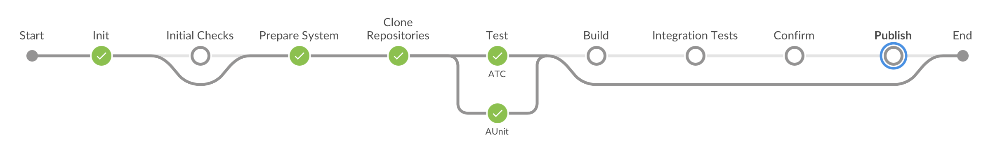

# ABAP Environment Pipeline

The goal of the ABAP environment pipeline is to enable Continuous Integration for the SAP BTP, ABAP environment, also known as Steampunk.
The pipeline contains several stages and supports different scenarios. The general idea is that the user can choose a subset of these stages, which fits her/his use case, for example running nightly ATC checks and AUnit tests or building an ABAP add-on for Steampunk.

## Scenarios

The following scenarios are available.

### Continuous Testing

This scenario is intended to be used improve the software quality through continuous checks and testing. Please refer to the [scenario documentation](../../scenarios/abapEnvironmentTest.md) for more information.

### Building ABAP Add-ons for Steampunk

This scenario is intended for SAP partners, who want to offer a Software as a Service (SaaS) solution on Steampunk. This is currently the only use case for building ABAP Add-ons and, more specifically, the stages "Initial Checks", "Build", "Integration Tests", "Confirm" and "Publish". Please refer to the [scenario documentation](../../scenarios/abapEnvironmentAddons.md) for more information.

## Pipeline Stages

The following stages and steps are part of the pipeline:

| Stage                    | Steps |
|--------------------------|-------|
| Init                     | -     |
| [Initial Checks](stages/initialChecks.md)           | [abapAddonAssemblyKitCheckPV](https://sap.github.io/jenkins-library/steps/abapAddonAssemblyKitCheckPV/), [abapAddonAssemblyKitCheckCVs](https://sap.github.io/jenkins-library/steps/abapAddonAssemblyKitCheckCVs/)|
| [Prepare System](stages/prepareSystem.md)           | [abapEnvironmentCreateSystem](https://sap.github.io/jenkins-library/steps/abapEnvironmentCreateSystem/) |
| [Clone Repositories](stages/cloneRepositories.md)       | [cloudFoundryCreateServiceKey](https://sap.github.io/jenkins-library/steps/cloudFoundryCreateServiceKey/), [abapEnvironmentPullGitRepo](https://sap.github.io/jenkins-library/steps/abapEnvironmentPullGitRepo/)|
| [Test](stages/test.md)                      | [cloudFoundryCreateServiceKey](https://sap.github.io/jenkins-library/steps/cloudFoundryCreateServiceKey/), [abapEnvironmentRunATCCheck](https://sap.github.io/jenkins-library/steps/abapEnvironmentRunATCCheck/), [abapEnvironmentRunAUnitTest](https://sap.github.io/jenkins-library/steps/abapEnvironmentRunAUnitTest/) |
| [Build](stages/build.md)                    | [cloudFoundryCreateServiceKey](https://sap.github.io/jenkins-library/steps/cloudFoundryCreateServiceKey/), [abapAddonAssemblyKitReserveNextPackages](https://sap.github.io/jenkins-library/steps/abapAddonAssemblyKitReserveNextPackages/), [abapEnvironmentAssemblePackages](https://sap.github.io/jenkins-library/steps/abapEnvironmentAssemblePackages/), [abapAddonAssemblyKitRegisterPackages](https://sap.github.io/jenkins-library/steps/abapAddonAssemblyKitRegisterPackages/), [abapEnvironmentAssembleConfirm](https://sap.github.io/jenkins-library/steps/abapEnvironmentAssembleConfirm/), [abapAddonAssemblyKitReleasePackages](https://sap.github.io/jenkins-library/steps/abapAddonAssemblyKitReleasePackages/), [abapAddonAssemblyKitCreateTargetVector](https://sap.github.io/jenkins-library/steps/abapAddonAssemblyKitCreateTargetVector/), [abapAddonAssemblyKitPublishTargetVector](https://sap.github.io/jenkins-library/steps/abapAddonAssemblyKitPublishTargetVector/)|
| [Integration Tests](stages/integrationTest.md)        | [cloudFoundryCreateService](https://sap.github.io/jenkins-library/steps/cloudFoundryCreateService/)|
| [Confirm](stages/confirm.md)                  | -     |
| [Publish](stages/publish.md)                  | [abapAddonAssemblyKitPublishTargetVector](https://sap.github.io/jenkins-library/steps/abapAddonAssemblyKitPublishTargetVector/)|
| [Post](stages/post.md)                     | [cloudFoundryDeleteService](https://sap.github.io/jenkins-library/steps/cloudFoundryDeleteService/)|

Please navigate to a stage or step to learn more details. [Here](configuration.md) you can find a step-by-step example on how to configure your pipeline.
