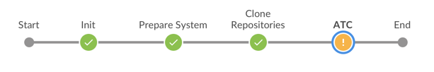

# ABAP Environment Pipeline

The goal of the ABAP Environment Pipeline is to enable Continuous Integration for the SAP Cloud Platform ABAP Environment, also known as Steampunk.
In the current state, the pipeline enables you to pull Software Components to specifc systems and perform ATC checks. The following stages and steps are part of the pipeline:

| Stage                    | Steps |
|--------------------------|-------|
| Init                     | -     |
| Prepare System           | [cloudFoundryCreateService](https://sap.github.io/jenkins-library/steps/cloudFoundryCreateService/), [cloudFoundryCreateServiceKey](https://sap.github.io/jenkins-library/steps/cloudFoundryCreateServiceKey/)|
| Clone Repositories       | [abapEnvironmentPullGitRepo](https://sap.github.io/jenkins-library/steps/abapEnvironmentPullGitRepo/)|
| ATC                      | [abapEnvironmentRunATCCheck](https://sap.github.io/jenkins-library/steps/abapEnvironmentRunATCCheck/)|
| Post                     | [cloudFoundryDeleteService](https://sap.github.io/jenkins-library/steps/cloudFoundryDeleteService/)|

Below you can find more details about the different stages. [Here](configuration.md) you can find more information about how to configure your pipeline.

## Init

In this stage, the pipeline is initialized. Nothing to see here.

## Prepare System

In this stage, the ABAP Environment system is created. This is done with the cloudFoundryCreateService step. As some parts of the system configuration is done after the Cloud Foundry instance was created, the following workaround is currently necessary:

An authorized user has to manually confirm that the ABAP Environment system is ready. This is the case when the email has been received by the initially provided administrator (as configured in the file `manifest.yml` - as described in [configuration](configuration.md)).

After the confirmation, the Communication Arrangement SAP_COM_0510 (SAP Cloud Platform ABAP Environment - Software Component Test Integration) is created using the step cloudFoundryCreateServiceKey. With the creation of the Communication Arrangement, a User and Password is created on the ABAP Environment system for the APIs that are used in the following stages.

## Clone Repositories

In this stage, the Software Components / Git repositories are pulled to the ABAP Environment system using the step abapEnvironmentPullGitRepo.
The step can receive a list of Software Components / repositories and pulls them successively.

## ATC

In this stage, ATC checks can be executed using abapEnvironmentRunATCCheck. The step can receive Software Components or packages (configured in YML file - as described in [configuration](configuration.md)). The results are returned in the checkstlye format. With the use of a pipeline extension, quality gates can be configured (see [step documentation](https://sap.github.io/jenkins-library/steps/abapEnvironmentRunATCCheck/) or the "Extensions" section in the [configuration](configuration.md)).

## Post

At the end of every pipeline (successful or unsuccessful), the system is deprovisioned using the step cloudFoundryDeleteService.
