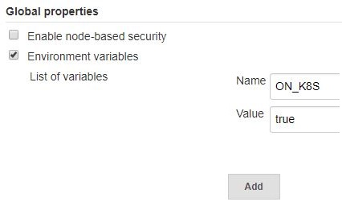

# SAP Cloud SDK Pipeline Configuration

## General configuration

| Property | Mandatory | Default Value | Description |
| --- | --- | --- | --- |
| `productiveBranch` | | `master` | The name of your default branch. This branch will be used for deploying your application. Other branches will skip deployment. |
| `projectName` | | `artifactId` from pom | Name of the project |
| `collectTelemetryData` | | `true` | No personal data is collected. For details, consult the [analytics documentation](https://github.com/SAP/cloud-s4-sdk-pipeline/blob/master/doc/operations/analytics.md). |
| `unsafeMode` | | `false` | Enable unsafe mode to skip checking environment variables for insecure elements. Only use this for demo purposes, **never for productive usage**. |
| `customDefaultsCredentialsId` | |  | Credentials (username / password) used to download [custom defaults](#customDefaults). |

### features

This section allows to enable or disable certain optional features.
This concept is known as *Feature Toggles*.

| Property | Mandatory | Default Value | Description |
| --- | --- | --- | --- |
| `parallelTestExecution` | | `off` | Run E2E Tests in parallel. This feature is disabled by default because it is [not supported](https://issues.jenkins-ci.org/browse/JENKINS-38442) in Blue Ocean. If this feature is enabled, we suggest not using the Blue Ocean interface and rely on the classic UI instead. |

Example:

```yaml
general:
  productiveBranch: 'master'
  projectName: 'example_project'
  features:
    parallelTestExecution: on
```

### jenkinsKubernetes

If the Jenkins is running on a kubernetes cluster as a pod, we can use the dynamic scaling feature in the pipeline. In order to enable this, an environment variable `ON_K8S` has to be set to `true` on the jenkins.

| Property | Mandatory | Default Value | Description |
| --- | --- | --- | --- |
| `jnlpAgent` | | `jenkins/jnlp-slave:latest` | Docker image for `jnlp` agent to be used |

In the Jenkins configuration section under `Manage Jenkins` menu, set the value for your environment variable under `Global properties` section.



The Jenkins spins up `jnlp` agent nodes on demand. By default, the `jenkins/jnlp-slave` docker image is used. We can also use the custom `jnlp` agent by configuring the same in the `.pipeline/config.yml` file as shown below.

```yaml
general:
  jenkinsKubernetes:
    jnlpAgent: jenkins/jnlp-slave:latest
```

## Stage configuration

### staticCodeChecks

The `staticCodeChecks` stage has been integrated into the `build` stage.
To configure static code checks, please configure the step `mavenExecuteStaticCodeChecks` as described [here](../../../steps/mavenExecuteStaticCodeChecks/).

### backendIntegrationTests

The `backendIntegrationTests` stage has been integrated into the project "Piper" stage `Integration`.
Thus, it is required to update the stage name in the stages section of your configuration to `integration`.
The configuration parameters available for the stage remain the same.

| Property | Mandatory | Default Value | Description |
| --- | --- | --- | --- |
| `retry` | | `1` | The number of times that integration tests will retry before aborting the build. **Note:** This will consume more time for the jenkins build. |
| `forkCount` | | `1C` | The number of JVM processes that are spawned to run the tests in parallel in case of using a maven based project structure. For more details visit the [surefire documentation](https://maven.apache.org/surefire/maven-surefire-plugin/test-mojo.html#forkCount). |
| `credentials` | | | The list of system credentials to be injected during integration tests. The following example will provide the username and password for the systems with the aliases ERP and SFSF. For this, it will use the Jenkins credentials entries erp-credentials and successfactors-credentials. You have to ensure that corresponding credential entries exist in your Jenkins configuration |

Example:

```yaml
integration:
  retry: 2
  credentials:
    - alias: 'ERP'
      credentialId: 'erp-credentials'
    - alias: 'SF'
      credentialId: 'successfactors-credentials'
```

The integration tests stage also offers the option to run a sidecar container, e.g. for running a database or another downstream system.
To use this optional feature the following configuration values have to be provided:

| Property | Mandatory | Default Value | Description |
| --- | --- | --- | --- |
|`sidecarImage` | | | Name of the Docker image that should be used. |
|`sidecarName` | | | On Docker: Name of the container in local network. On Kubernetes: Name of the container. |
|`sidecarReadyCommand` | | | Command executed inside the container which returns exit code 0 when the container is ready to be used. |
|`sidecarEnvVars` | | | Environment variables to set in the container. |

*Note: To access the container from your tests use the `sidecarName` as hostname on Docker or `localhost:portOfProcess` on Kubernetes.*

Example:

```yaml
integration:
  retry: 2
  credentials:
    - alias: 'ERP'
      credentialId: 'erp-credentials'
    - alias: 'SF'
      credentialId: 'successfactors-credentials'
  sidecarName: 'postgres'
  sidecarImage: 'postgres'
  sidecarReadyCommand: 'pg_isready'
  sidecarEnvVars:
    PORT: 8234
```

### frontendIntegrationTests

The `frontendIntegrationTests` stage has been integrated into the project "Piper" stage `Integration`.
Thus, it is required to update the stage name in the stages section of your configuration to `integration`.
The configuration parameters available for the stage remain the same.

| Property | Mandatory | Default Value | Description |
| --- | --- | --- | --- |
| `dockerImage` | | | The docker image to be used for running frontend integration tests. **Note:** This will only change the docker image used for unit testing in the frontend. For switching all npm based steps to a different npm or chromium version, you should configure the dockerImage via the executeNpm step. |

### frontendUnitTests

| Property | Mandatory | Default Value | Description |
| --- | --- | --- | --- |
| `dockerImage` | | | The docker image to be used for running frontend unit tests. **Note:** This will only change the docker image used for unit testing in the frontend. For switching all npm based steps to a different npm or chromium version, you should configure the dockerImage via the executeNpm step. |

### endToEndTests

For the stage `endToEndTests` the same configuration options are available as for the stage `productionDeployment`.

In addition to these options also the following ones are available for end-to-end tests:

It is possible to activate zero downtime deployment in end-to-end tests with the option `enableZeroDowntimeDeployment`.
This will lead to a blue-green-deployment on SCP Cloud Foundry respectively to a rolling update on SCP Neo.
By default this feature is turned off.

Running end-to-end tests can be restricted to the `productiveBranch` with the option `onlyRunInProductiveBranch`.
This might be useful when the end-to-end tests slow down development, and build failure on the `productiveBranch` is acceptable.
By default this feature is turned off.

Additional parameters can be passed for each end-to-end test deployment by specifying _optional_ `parameters` for an application URL.
These parameters are appended to the npm command during execution.
This could be used for example to split the entire end-to-end test scenario into multiple sub-scenarios and running these sub-scenarios on different deployments.
For example, when using nightwatch-api, these scenarios can be defined via annotations in the test descriptions and can be called with the `--tag` parameter as shown in the example below. Another option is to execute the end to end tests with various web browsers, e.g. chrome or firefox.

Example:

```yaml
endToEndTests:
  enableZeroDowntimeDeployment: true
  onlyRunInProductiveBranch: true
  appUrls:
    - url: <application url>
      credentialId: e2e-test-user-cf
      parameters: '--tag scenario1 --NIGHTWATCH_ENV=chrome'
    - url: <application url 2>
      credentialId: e2e-test-user-cf
      parameters: '--tag scenario2 --tag scenario3 --NIGHTWATCH_ENV=firefox'
```

### npmAudit

This stage has been removed in v43 of the Cloud SDK pipeline.

### performanceTests

| Property | Mandatory | Default Value | Description |
| --- | --- | --- | --- |
| `cfTargets` | | | The list of Cloud Foundry deployment targets required for the performance test stage. |
| `neoTargets` | | | The list of Neo deployment targets required for the performance test stage. |

For details on the properties `cfTargets` and `neoTargets` see the stage `productionDeployment`.

### s4SdkQualityChecks

This stage has been removed in v43 of the Cloud SDK pipeline.

### checkmarxScan

The `checkmarxScan` stage has been merged into the project "Piper" stage `security`.
To configure Checkmarx please configure the step `checkmarxExecuteScan` as described [in the step documentation](../../../steps/checkmarxExecuteScan/).

### productionDeployment

| Property | Mandatory | Default Value | Description |
| --- | --- | --- | --- |
|`cfCreateServices`| | | The list of services which should be created before deploying the application as defined below.  |
| `cfTargets` | | | The list of productive Cloud Foundry deployment targets to be deployed when a build of your productive branch succeeds. |
| `neoTargets`| | | The list of productive Neo deployment targets to be deployed when a build of your productive branch succeeds. |
| `appUrls` | | |  The URLs under which the app is available after deployment. Each appUrl can be a string with the URL or a map containing a property url and a property credentialId. An example is shown in the configuration for the stage endToEndTests. |

### cfCreateServices

The option `cfCreateServices` is especially useful if you don't use MTA and need a way to declaratively define which services should be created in Cloud Foundry.
The following properties can be defined for each element in the list.
For a detailed documentation of the indivitual properties please consult the [step documentation](../../../steps/cloudFoundryCreateService/).

| Property | Mandatory | Default Value | Description |
| --- | --- | --- | --- |
| `org` | X** | | The organization where you want to deploy your app. |
| `space` | X** | | The space where you want to deploy your app. |
| `serviceManifest`| X** |  | Manifest file that needs to be used defining the services. |
| `manifestVariablesFiles`| X** |  | Variables that should be replaced in the service manifest file. |
| `credentialsId` | X**|  | ID to the credentials that will be used to connect to the Cloud Foundry account. |
| `apiEndpoint` | X** |  | URL to the Cloud Foundry endpoint. |

** The parameters can either be specified here or for the step `cloudFoundryDeploy` or globally in the general section under the key `cloudFoundry`.

### cfTargets and neoTargets

You can either specify the property `cfTargets` or `neoTargets`.

For `cfTargets` the following properties can be defined:

| Property | Mandatory | Default Value | Description |
| --- | --- | --- | --- |
| `org` | X** | | The organization where you want to deploy your app. |
| `space` | X** | | The space where you want to deploy your app. |
| `appName` | X** (not for MTA) |  | Name of the application. |
| `manifest` | X** (not for MTA) |  | Manifest file that needs to be used. |
| `credentialsId` | X**|  | ID to the credentials that will be used to connect to the Cloud Foundry account. |
| `apiEndpoint` | X** |  | URL to the Cloud Foundry endpoint. |
| `mtaExtensionDescriptor` |  |  | (**Only for MTA-projects**) Path to the mta extension description file. For more information on how to use those extension files please visit the [SAP HANA Developer Guide](https://help.sap.com/viewer/4505d0bdaf4948449b7f7379d24d0f0d/2.0.02/en-US/51ac525c78244282919029d8f5e2e35d.html). |
| `mtaExtensionCredentials` |  |  | (**Only for MTA-projects**) Map of credentials that need to be replaced in the `mtaExtensionDescriptor`. This map needs to be created as `value-to-be-replaced`:`id-of-a-credential-in-jenkins` |

** The parameters can either be specified here or for the step `cloudFoundryDeploy` or globally in the general section under the key `cloudFoundry`.

### Examples

```yaml
general:
  cloudFoundry:
    org: 'myorg'
    space: 'Prod'
    apiEndpoint: 'https://api.cf.sap.hana.ondemand.com'
    credentialsId: 'CF-DEPLOY-DEFAULT'
    manifestVariablesFiles: ['manifest-variables.yml']
stages:
  productionDeployment:
    appUrls:
      - url: <application url>
        credentialId: e2e-test-user-cf
    cfCreateServices:
      - serviceManifest: 'services-manifest.yml'
      - serviceManifest: 'services-manifest.yml'
        space: 'Prod2'
        org: 'myorg2'
    cfTargets:
      - appName: 'exampleapp'
        manifest: 'manifest.yml'
      - space: 'Prod2'
        org: 'myorg2'
        appName: 'exampleapp'
        manifest: 'manifest.yml'
        credentialsId: 'CF-DEPLOY-PROD1'
```

The MTA projects can make use of the extension files and one can use a Jenkins credential store to inject the credentials during runtime instead of storing them as a plain text in the extension file.
In order to use this feature, use a [JSP style or GString style](http://docs.groovy-lang.org/latest/html/api/groovy/text/GStringTemplateEngine.html) place holder in the extension file and provide the respective credential id in the `.pipeline/config.yml` as shown below.

Please note currently only the Jenkins [Sercret text](https://jenkins.io/doc/book/using/using-credentials/) is the supported format for runtime credential substitution.

```yaml
#.pipeline/config.yml
productionDeployment:
  appUrls:
    - url: <application url>
      credentialId: e2e-test-user-cf
  cfTargets:
    - space: 'Prod'
      org: 'myorg'
      appName: 'exampleapp'
      manifest: 'manifest.yml'
      credentialsId: 'CF-DEPLOY'
      apiEndpoint: '<Cloud Foundry API endpoint>'
      mtaExtensionDescriptor: 'path to mta extension description file'
      mtaExtensionCredentials:
        brokerCredential: sercretText-id-in-jenkins
```

```yaml
#extension_file.mtaext
_schema-version: "3.1"
version: 0.0.1
extends: myApplication
ID: my-application
parameters:
  broker-credentials: <%= brokerCredential %>
```

For `neoTargets` the following properties can be defined:

| Property | Mandatory | Default Value | Description |
| --- | --- | --- | --- |
| `host` | X | | Host of the region you want to deploy to, see [Regions](https://help.sap.com/viewer/65de2977205c403bbc107264b8eccf4b/Cloud/en-US/350356d1dc314d3199dca15bd2ab9b0e.html#loio350356d1dc314d3199dca15bd2ab9b0e)|
| `account` | X | | Identifier of the subaccount|
| `application` | X | | Name of the application in your account |
| `credentialsId` | | `CI_CREDENTIALS_ID` | ID of the credentials stored in Jenkins and used to deploy to SAP Cloud Platform |
| `environment` | | | Map of environment variables in the form of KEY: VALUE|
| `vmArguments` | | | String of VM arguments passed to the JVM|
| `size`| | `lite` | Size of the JVM, e.g. `lite`, `pro'`, `prem`, `prem-plus` |
| `runtime` | X | | Name of the runtime: neo-java-web, neо-javaee6-wp, neо-javaee7-wp. See the [runtime](https://help.sap.com/viewer/65de2977205c403bbc107264b8eccf4b/Cloud/en-US/937db4fa204c456f9b7820f83bc87118.html) for more information.|
| `runtimeVersion` | X | | Version of the runtime. See [runtime-version](https://help.sap.com/viewer/65de2977205c403bbc107264b8eccf4b/Cloud/en-US/937db4fa204c456f9b7820f83bc87118.html) for more information.|

Example:

```yaml
productionDeployment:
  neoTargets:
    - host: 'eu1.hana.ondemand.com'
      account: 'myAccount'
      application: 'exampleapp'
      credentialsId: 'NEO-DEPLOY-PROD'
      environment:
      STAGE: Production
      vmArguments: '-Dargument1=value1 -Dargument2=value2'
      runtime: 'neo-javaee6-wp'
      runtimeVersion: '2'
```

### artifactDeployment

#### nexus

The deployment of artifacts to nexus can be configured with a map containing the following properties:

| Property | Mandatory | Default Value | Description |
| --- | --- | --- | --- |
| `version` | | `nexus3` | Version of nexus. Can be `nexus2` or `nexus3`. |
| `url` | X | | URL of the nexus. The scheme part of the URL will not be considered, because only `http` is supported. |
| `mavenRepository` | | | Name of the nexus repository for Maven and MTA artifacts. Ignored if the project does not contain `pom.xml` or `mta.yml` in the project root. |
| `npmRepository` | | | Name of the nexus repository for NPM artifacts. Ignored if the project does not contain a `package.json` in the project root directory. |
| `groupId` | | | Common group ID for MTA build artifacts, ignored for Maven projects. |
| `credentialsId` | | | ID to the credentials which is used to connect to Nexus. Anonymous deployments do not require a `credentialsId`.|

##### Choosing what to deploy into the npm repository

The Pipeline performs an [npm publish](https://docs.npmjs.com/cli/publish) command to deploy npm modules.
This deployment might include files that you don't want to deploy.
See [here](https://docs.npmjs.com/misc/developers#keeping-files-out-of-your-package) for npm documentation.

**WARNING:** The `.gitignore` file is not available in the pipeline during the artifact deployment.
To exclude files from that, please create a `.npmignore` file, copy the contents of your `.gitignore` file and add specific ignores for example for `*.java` files.

Example:

```yaml
artifactDeployment:
  nexus:
    version: nexus2
    url: nexus.mycorp:8080/nexus
    mavenRepository: snapshots
    npmRepository: npm-repo
    credentialsId: 'NEXUS-DEPLOY'
```

### whitesourceScan

The `whitesourceScan` stage has been merged into the project "Piper" stage `security`.
To configure WhiteSource please configure the step `whitesourceExecuteScan` as described [in the step documentation](../../../steps/whitesourceExecuteScan/).

### fortifyScan

The `fortifyScan` stage has been merged into the project "Piper" stage `security`.
To configure Fortify please configure the step `fortifyExecuteScan` as described [in the step documentation](../../../steps/fortifyExecuteScan/).

### lint

The `lint` stage has been integrated into the `build` stage.
The options for the use of linting tools remain the same and are described in the [build tools section](../build-tools/#lint).

Note, the available configuration options can be found in the related [step documentation](../../../steps/npmExecuteLint/#parameters).

### compliance

The stage `compliance` executes [SonarQube](https://www.sonarqube.org/) scans, if the step [`sonarExecuteScan`](../../../steps/sonarExecuteScan/) is configured.

This is an optional feature for teams who prefer to use SonarQube.
Note that it does some scans that are already done by the pipeline by default.

| Property | Mandatory | Default Value | Description |
| --- | --- | --- | --- |
| `runInAllBranches` |  |  false | Define whether the scan should also happen in non productive branches, i.e. if your SonarQube instance supports that. |

**Note:** The stage is skipped by default if you're not on a productive branch (`master` by default).
You can change this by setting `runInAllBranches` to `true`, which requires the commercial version of SonarQube.

Example:

```yaml
compliance:
    runInAllBranches: true
```

### postPipelineHook

This stage does nothing.
Its purpose is to be overridden if required.

See the documentation for [pipeline extensibility](../../../extensibility/) for details on how to extend a stage.
The name of an extension file must be `postPipelineHook.groovy`.
Also, the stage (and thus an extension) is only executed if a stage configuration exists, like in this example:

```yaml
  postPipelineHook:
    enabled: true
```

## Step configuration

This section describes the steps that are available only in SAP Cloud SDK Pipeline.
For common project "Piper" steps, please see the _Library steps_ section of the documentation.

### checkGatling

[Gatling](https://gatling.io/) is used as one of the performance tests tool.

| Property | Mandatory | Default Value | Description |
| --- | --- | --- | --- |
| `enabled` | | `false` | You can enable Gatling tests by turning the flag to `true`. |

Example:

```yaml
checkGatling:
  enabled: true
```

### checkJMeter

[Apache JMeter](http://jmeter.apache.org/) is executed as part of performance tests of the application. The user is free to choose between JMeter and Gatling or both.

| Property | Mandatory | Default Value | Description |
| --- | --- | --- | --- |
| `options` | |  | Options such as proxy. |
| `testPlan` | | `./performance-tests/*` | The directory where the test plans reside. Should reside in a subdirectory under `performance-tests` directory if both JMeter and Gatling are enabled.|
| `dockerImage` | | `famiko/jmeter-base` | JMeter docker image. |
| `failThreshold ` | | `100` | Marks build as `FAILURE` if the value exceeds the threshold. |
| `unstableThreshold ` | | `90` | Marks build as `UNSTABLE` if the value exceeds the threshold. |

Example:

```yaml
checkJMeter:
  options: '-H my.proxy.server -P 8000'
  testPlan: './performance-tests/JMeter/*' # mandatory parameter if both JMeter and gatling are enabled
  dockerImage: 'famiko/jmeter-base'
  failThreshold : 80
  unstableThreshold: 70
```

### executeNpm

This step has been removed in v43 of the Cloud SDK pipeline.
Please use the step [npmExecuteScripts](../../../steps/npmExecuteScripts/) instead.

### debugReportArchive

The documentation for the `debugReportArchive` step has been moved [here](../../../steps/debugReportArchive/).

## Post action configuration

### sendNotification

The `sendNotification` post-build action has been removed in version v43 of the Cloud SDK pipeline.
