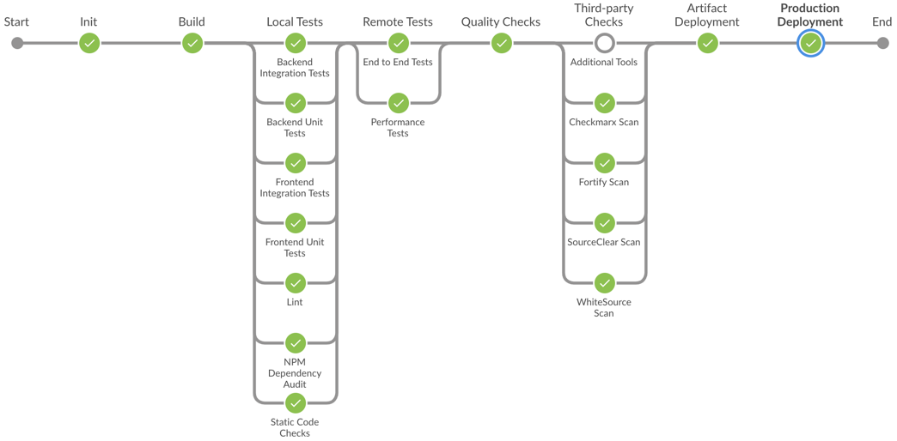

# SAP Cloud SDK Pipeline

</a>

If you are building an application with [SAP Cloud SDK](https://community.sap.com/topics/cloud-sdk), the [SAP Cloud SDK pipeline](https://github.com/SAP/cloud-s4-sdk-pipeline) helps you to quickly build and deliver your app in high quality.
Thanks to highly streamlined components, setting up and delivering your first project will just take minutes.

## Qualities and Pipeline Features

The SAP Cloud SDK pipeline is based on project "Piper" and offers unique features for assuring that your SAP Cloud SDK based application fulfills the highest quality standards.
In conjunction with the SAP Cloud SDK libraries, the pipeline helps you to implement and automatically assure application qualities, for example:

* Functional correctness via:
    * Backend and frontend unit tests
    * Backend and frontend integration tests
    * User acceptance testing via headless browser end-to-end tests
* Non-functional qualities via:
    * Dynamic resilience checks
    * Performance tests based on *Gatling* or *JMeter*
    * Code Security scans based on *Checkmarx* and *Fortify*
    * Dependency vulnerability scans based on *Whitesource*
    * IP compliance scan based on *Whitesource*
    * Zero-downtime deployment
    * Proper logging of application errors

For more details, see [Cloud Qualities](../cloud-qualities).

## Supported Project Types

The pipeline supports the following types of projects:

* Java projects based on the [SAP Cloud SDK Archetypes](https://mvnrepository.com/artifact/com.sap.cloud.sdk.archetypes).
* JavaScript projects based on the [SAP Cloud SDK JavaScript Scaffolding](https://github.com/SAP/cloud-s4-sdk-examples/tree/scaffolding-js).
* TypeScript projects based on the [SAP Cloud SDK TypeScript Scaffolding](https://github.com/SAP/cloud-s4-sdk-examples/tree/scaffolding-ts).
* SAP Cloud Application Programming Model (CAP) projects based on the _SAP Cloud Platform Business Application_ WebIDE Template.

You can find more details about the supported project types and build tools in [Build Tools](../build-tools).

## Legal Notes

Note: This license of this repository does not apply to the SAP Cloud SDK for Continuous Delivery Logo referenced in this page
