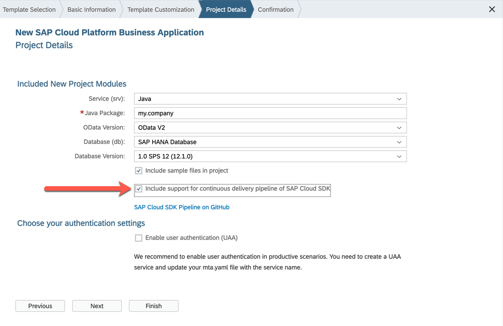

# Build and Deploy SAP Cloud Application Programming Model Applications

In this scenario, we will setup a CI/CD Pipeline for a SAP Cloud Application Programming Model (CAP) project, which is based on the _SAP Cloud Platform Business Application_ WebIDE Template.

## Prerequisites

* You have an account on SAP Cloud Platform in the Cloud Foundry environment. See [Accounts](https://help.sap.com/viewer/65de2977205c403bbc107264b8eccf4b/Cloud/en-US/8ed4a705efa0431b910056c0acdbf377.html).
* You have setup a suitable Jenkins instance as described in [Guided Tour](../guidedtour.md)

## Context

The Application Programming Model for SAP Cloud Platform is an end-to-end best practice guide for developing applications on SAP Cloud Platform and provides a supportive set of APIs, languages, and libraries.
For more information about the SAP Cloud Application Programming Model, see [Working with the SAP Cloud Application Programming Model](https://help.sap.com/viewer/65de2977205c403bbc107264b8eccf4b/Cloud/en-US/00823f91779d4d42aa29a498e0535cdf.html).

## Getting started

To get started, generate a project in SAP Web IDE based on the _SAP Cloud Platform Business Application_ template.
Make sure to check the Include support for continuous delivery pipeline of SAP Cloud SDK checkbox, as in this screenshot:



This will generate a project which already includes a `Jenkinsfile`, and a `pipeline_config.yml` file.

!!! note "New location of pipeline configuration file"
    The SAP Cloud SDK Pipeline recently changed the default location for the configuration file from `pipeline_config.yml` to `.config/pipeline` to have a consistent user experience with other piper pipelines.
    For a limited amount of time starting with version v29 both locations can be used.
    In the following the configuration file is referenced by its new location.


In case you already created your project without this option, you'll need to copy and paste two files into the root directory of your project, and commit them to your git repository:

* [`Jenkinsfile`](https://github.com/SAP/cloud-s4-sdk-pipeline/blob/master/archetype-resources/Jenkinsfile)
* [`.pipeline/config.yml`](https://github.com/SAP/cloud-s4-sdk-pipeline/blob/master/archetype-resources/cf-pipeline_config.yml)
    * Note: The file must be named `.pipeline/config.yml`, despite the different name of the file template

!!! note "Using the right project structure"
    This only applies to projects created based on the _SAP Cloud Platform Business Application_ template after September 6th 2019. They must comply with the structure which is described [here](https://github.com/SAP/cloud-s4-sdk-pipeline/blob/master/doc/pipeline/build-tools.md#sap-cloud-application-programming-model--mta).

If your project uses SAP HANA containers (HDI), you'll need to configure `createHdiContainer` and `cloudFoundry` in the `backendIntegrationTests` stage in your `.pipeline/config.yml` file as documented [here](https://github.com/SAP/cloud-s4-sdk-pipeline/blob/master/configuration.md#backendintegrationtests)

Now, you'll need to push the code to a git repository.
This is required because the pipeline gets your code via git.
This might be GitHub, or any other cloud or on-premise git solution you have in your company.

Be sure to configure the [`productionDeployment `](https://github.com/SAP/cloud-s4-sdk-pipeline/blob/master/configuration.md#productiondeployment) stage so your changes are deployed to SAP Cloud Platform automatically.

## Legacy documentation

If your project is not based on the _SAP Cloud Platform Business Application_ WebIDE template, you could either migrate your code to comply with the structure which is described [here](https://github.com/SAP/cloud-s4-sdk-pipeline/blob/master/doc/pipeline/build-tools.md#sap-cloud-application-programming-model--mta), or you can use a self built pipeline, as described in this section.

### Prerequisites

* You have an account on SAP Cloud Platform in the Cloud Foundry environment. See [Accounts](https://help.sap.com/viewer/65de2977205c403bbc107264b8eccf4b/Cloud/en-US/8ed4a705efa0431b910056c0acdbf377.html).
* You have downloaded and installed the Cloud Foundry command line interface (CLI). See [Download and Install the Cloud Foundry Command Line Interface](https://help.sap.com/viewer/65de2977205c403bbc107264b8eccf4b/Cloud/en-US/afc3f643ec6942a283daad6cdf1b4936.html).
* You have installed the multi-target application plug-in for the Cloud Foundry command line interface. See [Install the Multi-Target Application Plug-in in the Cloud Foundry Environment](https://help.sap.com/viewer/65de2977205c403bbc107264b8eccf4b/Cloud/en-US/27f3af39c2584d4ea8c15ba8c282fd75.html).
* You have installed the Java Runtime Environment 8.
* You have installed Jenkins 2.60.3 or higher.
* You have set up Project “Piper”. See [README](https://github.com/SAP/jenkins-library/blob/master/README.md).
* You have installed the Multi-Target Application (MTA) Archive Builder 1.0.6 or newer. See [SAP Development Tools](https://tools.hana.ondemand.com/#cloud).
* You have installed Node.js including node and npm. See [Node.js](https://nodejs.org/en/download/).

### Context

The Application Programming Model for SAP Cloud Platform is an end-to-end best practice guide for developing applications on SAP Cloud Platform and provides a supportive set of APIs, languages, and libraries. For more information about the SAP Cloud Application Programming Model, see [Working with the SAP Cloud Application Programming Model](https://help.sap.com/viewer/65de2977205c403bbc107264b8eccf4b/Cloud/en-US/00823f91779d4d42aa29a498e0535cdf.html).

In this scenario, we want to show how to implement a basic continuous delivery process for developing applications according to this programming model with the help of project "Piper" on Jenkins. This basic scenario can be adapted and enriched according to your specific needs.

### Example

#### Jenkinsfile

```groovy
@Library('piper-lib-os') _

node(){
  stage('Prepare')   {
      deleteDir()
      checkout scm
      setupCommonPipelineEnvironment script:this
  }

  stage('Build')   {
      mtaBuild script:this
  }

  stage('Deploy')   {
      cloudFoundryDeploy script:this, deployTool:'mtaDeployPlugin'
  }
}
```

#### Configuration (`.pipeline/config.yml`)

```yaml
steps:
  mtaBuild:
    buildTarget: 'CF'
  cloudFoundryDeploy:
    cloudFoundry:
      credentialsId: 'CF'
      apiEndpoint: '<CF Endpoint>'
      org: '<CF Organization>'
      space: '<CF Space>'
```

#### Parameters

For the detailed description of the relevant parameters, see:

* [mtaBuild](../steps/mtaBuild.md)
* [cloudFoundryDeploy](../steps/cloudFoundryDeploy.md)
