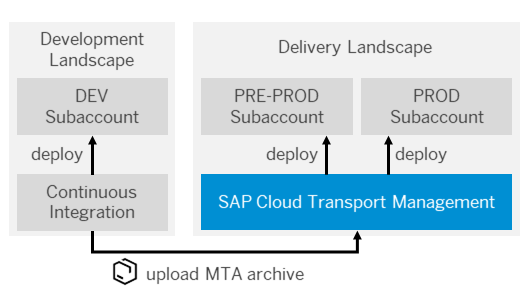

# Integrate SAP Cloud Platform Transport Management Into Your CI/CD Pipeline

Extend your CI/CD pipeline with SAP Cloud Platform Transport Management to add an enterprise-ready change and release management process and enable the transport of cloud-based applications on SAP Cloud Platform between several stages.

## Context

This procedure explains how to upload a [multitartget application](https://www.sap.com/documents/2016/06/e2f618e4-757c-0010-82c7-eda71af511fa.html) from a CI/CD pipeline to SAP Cloud Platform Transport Management and then import it into its target environment.

SAP Cloud Platform Transport Management allows you to manage the transport of development artifacts and application-specific content between different SAP Cloud Platform accounts. It adds transparency to the audit trail of changes so that you get information about who performed which changes in your production accounts and when they did it. At the same time, the Transport Management service enables a separation of concerns: For example, a developer of an application or SAP Cloud Platform content artifacts can trigger the propagation of changes, while the resulting transport is handled by a central operations team. For more information, see [SAP Cloud Platform Transport Management](https://help.sap.com/viewer/product/TRANSPORT_MANAGEMENT_SERVICE/Cloud/en-US).

The following graphic provides an overview about the interplay between continuous integration and Transport Management:



## Prerequisites

* You have an existing CI pipeline, which you want to extend with SAP Cloud Platform Transport Management.
* You have an MTA project and the folder structure of its sources corresponds to the standard MTA structure. For more information, see [The Multitarget Application Model](https://www.sap.com/documents/2016/06/e2f618e4-757c-0010-82c7-eda71af511fa.html).
* You have access to SAP Cloud Platform Transport Management. See [Provide Access to SAP Cloud Platform Transport Management](https://help.sap.com/viewer/7f7160ec0d8546c6b3eab72fb5ad6fd8/Cloud/en-US/13894bed9e2d4b25aa34d03d002707f9.html).
* You have set up SAP Cloud Platform Transport Management and created a service key. See [Set Up the Environment to Transport Content Archives directly in an Application](https://help.sap.com/viewer/7f7160ec0d8546c6b3eab72fb5ad6fd8/Cloud/en-US/8d9490792ed14f1bbf8a6ac08a6bca64.html).
* You have configured your Transport Management landscape. See [Configuring the Landscape](https://help.sap.com/viewer/7f7160ec0d8546c6b3eab72fb5ad6fd8/Cloud/en-US/3e7b04236d804a4eb80e42c6360209f1.html).

## Procedure

You can use this scenario to extend any CI process that meets the prerequisites, for example, the one described in [Build and Deploy SAPUI5 or SAP Fiori Applications on SAP Cloud Platform with Jenkins](https://sap.github.io/jenkins-library/scenarios/ui5-sap-cp/Readme/).

The following graphic shows an example of the detailed procedure when combining continuous integration and SAP Cloud Platform Transport Management:


The process flow contains the following steps:

1. The CI server builds a multitarget application (MTA) archive.
1. The MTA is uploaded into the import queue of the target node, which is specified in the CI pipeline (in this example, PRE-PROD).
1. The release manager manually triggers or schedules the import, which results in the physical deployment of the MTA archive into the corresponding subaccount (in this example, PRE-PROD).
1. As soon as the import is executed, a transport is triggered along the defined transport route so that the MTA archive reaches the import queue of the next node (in this example, PROD).
1. There, the physical import into the corresponding subaccount can be either triggered manually by the release manager or automatically by using the scheduling mechanisms of SAP Cloud Platform Transport Management.

## Example

### Jenkinsfile

If you use the pipeline of the following code snippet, you only have to configure it in the .pipeline/config.yml.

Following the convention for pipeline definitions, use a Jenkinsfile, which resides in the root directory of your development sources.

```groovy
@Library('piper-lib-os') _

piperPipeline script:this
```

### Configuration (`.pipeline/config.yml`)

This is a basic configuration example, which is also located in the sources of the project.

```yaml
steps:
  tmsUpload:
    credentialsId: tms-secret-key
    nodeName: tms_target_node
    mtaPath: com.piper.example.tms.mtar
    customDescription: Custom-Transport-Description
```

#### Configration for the Upload to Transport Management

| Parameter          | Description |
| -------------------|-------------|
| `credentialsId` |Credentials that are used for the file and node uploads to the Transport Management Service.|
| `nodeName`|Defines the name of the node to which the *.mtar file is uploaded.|
| `mtaPath`|Defines the path to *.mtar for the upload to the Transport Management Service.|
| `customDescription`| Can be used as description of a transport request. Overwrites the default (Default: Corresponding Git Commit-ID).|

### Parameters

For a detailed description of the relevant parameters, see [tmsUpload](../../steps/tmsUpload/).
