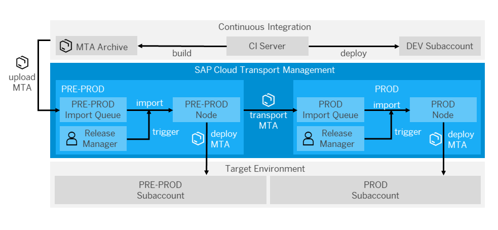

# Integrate SAP Cloud Transport Management Into Your CI/CD Pipeline

Extend your CI/CD pipeline with SAP Cloud Transport Management service to add an enterprise-ready change and release management process and enable the transport of cloud-based applications on SAP Business Technology Platform (BTP) between several stages.

## Context

This procedure explains how to upload a [multitarget application (MTA)](https://www.sap.com/documents/2016/06/e2f618e4-757c-0010-82c7-eda71af511fa.html) from a CI/CD pipeline to Cloud Transport Management and then import it into its target environment.

Cloud Transport Management allows you to manage the transport of development artifacts and application-specific content between different SAP BTP accounts. It adds transparency to the audit trail of changes so that you get information about who performed which changes in your production accounts and when they did it. At the same time, Cloud Transport Management enables a separation of concerns: For example, a developer of an application or of SAP Cloud content artifacts can trigger the propagation of changes, while the resulting transport is handled by a central operations team. For more information, see [SAP Cloud Transport Management](https://help.sap.com/viewer/product/TRANSPORT_MANAGEMENT_SERVICE/Cloud/en-US).

The following graphic provides an overview about the interplay between continuous integration and Cloud Transport Management:


## Prerequisites

* You have an existing CI pipeline, which you want to extend with Cloud Transport Management.
* You have an multitarget application (MTA) project, and the folder structure of its sources corresponds to the standard MTA structure. For more information about MTAs, see:
  * [Multitarget Applications in the Cloud Foundry Environment](https://help.sap.com/viewer/65de2977205c403bbc107264b8eccf4b/Cloud/en-US/d04fc0e2ad894545aebfd7126384307c.html)
  * [Multitarget Applications for the Neo Environment](https://help.sap.com/viewer/ea72206b834e4ace9cd834feed6c0e09/Cloud/en-US/e1bb7eb746d34237b8b47035adff5022.html)
* You have access to Cloud Transport Management. See [Provide Access to SAP Cloud Transport Management](https://help.sap.com/viewer/7f7160ec0d8546c6b3eab72fb5ad6fd8/Cloud/en-US/13894bed9e2d4b25aa34d03d002707f9.html).
* You have set up Cloud Transport Management and created a service key. See [Set Up the Environment to Transport Content Archives directly in an Application](https://help.sap.com/viewer/7f7160ec0d8546c6b3eab72fb5ad6fd8/Cloud/en-US/8d9490792ed14f1bbf8a6ac08a6bca64.html).
* You have configured your transport landscape. See [Configuring the Landscape](https://help.sap.com/viewer/7f7160ec0d8546c6b3eab72fb5ad6fd8/Cloud/en-US/3e7b04236d804a4eb80e42c6360209f1.html).

## Procedure

You can use this scenario to extend any CI process that meets the prerequisites, for example, the one described in [Build and Deploy SAPUI5 or SAP Fiori Applications on SAP BTP with Jenkins](https://sap.github.io/jenkins-library/scenarios/ui5-sap-cp/Readme/).

The following graphic shows an example of the detailed procedure when combining continuous integration and Cloud Transport Management:



The process flow contains the following steps:

1. The CI server builds a MTA archive.
1. The MTA is uploaded into the import queue of the target node, which is specified in the CI pipeline (in this example, PRE-PROD).
1. Optionally, for transports in Cloud Foundry environment, MTA extension descriptors can be uploaded to the nodes in the transport landscape to provide node-specific import configurations. The MTA extension descriptor file must either be part of the repository, or be the result of the build process.
1. The release manager manually triggers the import, or schedules it, which results in the physical deployment of the MTA archive into the corresponding subaccount (in this example, PRE-PROD). If an MTA extension descriptor was uploaded for this node, it will be used for the import.
1. As soon as the import is executed, a transport is triggered along the defined transport route so that the MTA archive reaches the import queue of the next node (in this example, PROD).
1. There, the physical import into the corresponding subaccount can be either triggered manually by the release manager or automatically by using the scheduling mechanisms of Cloud Transport Management.

## Example

### Jenkinsfile

If you use the pipeline of the following code snippet, you only have to configure it in the .pipeline/config.yml.

Following the convention for pipeline definitions, use a Jenkinsfile, which resides in the root directory of your development sources.

```groovy
@Library('piper-lib-os') _

piperPipeline script:this
```

### Configuration (`.pipeline/config.yml`)

This is a basic configuration example, which is also located in the sources of the project.

```yaml
steps:
  tmsUpload:
    credentialsId: tms-secret-key
    nodeName: PRE-PROD
    mtaPath: com.piper.example.tms.mtar
    customDescription: Custom-Transport-Description

# uploading MTA extension descriptors, optional step
    mtaVersion: 1.0.0
    nodeExtDescriptorMapping:
      PRE-PROD: 'scv_x_preprod.mtaext'
      PROD: 'scv_x_prod.mtaext'

stages:
  Release:
    tmsUpload: true

```

#### Configuration for the Upload to Cloud Transport Management

| Parameter          | Description |
| -------------------|-------------|
| `credentialsId` |Credentials that are used for the file and node uploads to Cloud Transport Management.|
| `nodeName`|Defines the name of the node to which the *.mtar file is uploaded.|
| `mtaPath`|Defines the path to the *.mtar file for the upload to Cloud Transport Management.|
| `customDescription`|Optional: Description of a transport request. Overwrites the default (Default: Corresponding Git Commit-ID).|
|`nodeExtDescriptorMapping`|Optional: Defines the mapping between a transport node and the MTA extension descriptor file that is used for the transport node. You specify the node name and the relative path to the MTA extension descriptor file using the syntax which is shown in the configuration example.|
|`mtaVersion`|Optional: Defines the version of the MTA for which the MTA extension descriptor is used. You can use an asterisk (*) to accept any MTA version, or use a specific version compliant with SemVer 2.0, e.g. 1.0.0 (see semver.org). If the parameter is not configured, an asterisk is used.|

### Parameters

For a detailed description of the relevant parameters, see [tmsUpload](../../steps/tmsUpload/).
