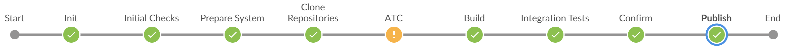

# Build and Publish Add-on Products on SAP BTP, ABAP Environment

!!! caution "Current limitations"
    - gCTS-related restrictions apply, please refer to [gCTS: restrictions in supported object types](https://launchpad.support.sap.com/#/notes/2888887)
    - __Table entries are currently delivered during add-on build with generic keys__ – thus it is strongly recommended to transport TABUs only with the software component the table definition belongs to and not in foreign software components to prevent loss of data. The possibility to deliver individual table keys as part of add-on build might be supported at a later point in time.

!!! caution "Required project "Piper" library version"
    The recommended project "Piper" library version can be found in [SAP Note 3032800](https://launchpad.support.sap.com/#/notes/3032800).<br>
    A specific version can be used by referencing the version number in the [Jenkinsfile](../../pipelines/abapEnvironment/configuration/#2-jenkinsfile).

## Introduction

This scenario describes how an add-on for the SAP BTP, ABAP environment is built. It is intended for SAP partners who want to provide a Software as a Service (SaaS) solution on the SAP BTP using the ABAP Environment. Therefore, a partner development contract (see [SAP PartnerEdge Test, Demo & Development Price List](https://partneredge.sap.com/en/library/assets/partnership/sales/order_license/pl_pl_part_price_list.html)) is required. This page aims to provide an overview of the build process of the add-on.

The development on SAP BTP, ABAP environment systems is done within [“software components”](https://help.sap.com/viewer/65de2977205c403bbc107264b8eccf4b/Cloud/en-US/58480f43e0b64de782196922bc5f1ca0.html) (also called: “repositories”). The add-ons being built in this scenario are made up by one or multiple software components combined to an add-on product. The “ABAP environment pipeline” can be used to build and publish the add-on product. Please read on for more details about the Add-on Product and the build process.

Of course, this tackles only the upstream part of the SaaS solution lifecycle. Once the add-on is published, it can be consumed as a [multitenant application in ABAP environment](https://help.sap.com/viewer/65de2977205c403bbc107264b8eccf4b/Cloud/en-US/195031ff8f484b51af16fe392ec2ae6e.html).

A comprehensive guidance on how to develop and operate SaaS applications using add-ons, can be found [here](https://help.sap.com/viewer/65de2977205c403bbc107264b8eccf4b/Cloud/en-US/e3c38ebaefc44523b679e7a0c375bc86.html).

## The Add-on Product

The installation and maintenance of ABAP software is controlled via add-on product versions. An __add-on product version__ is a „bundle" of software component versions made available at the same time for implementing a well-defined scope of functionality. It is the delivery view on a software portfolio.

### Add-on Product Version

An add-on product version is defined by a name and a version string. The name of an add-on product is a string with a maximum of 30 characters and consists of the [namespace](https://launchpad.support.sap.com/#/notes/84282) and a freely chooseble part - `/NAMESPC/PRODUCTX`. The add-on product name should only include uppercase characters.

The version string consists of three numbers separated by a dot - `1.2.0`. The numbers in the version string have a hierarchic relationship:

- The first number denotes the __release__. Release deliveries contain the complete scope of functionality. It is possible to change the software component version bundle in a new release.
- The second number denotes the __support package stack level__. A support package stack consists of support package deliveries of the contained software component versions.
- The third number denotes the __patch level__. A Patch delivery contains patch deliveries of the contained software component versions.

### Software Component Version

!!! note "Development on SAP BTP, ABAP environment"
    As you may know, the development in the SAP BTP, ABAP environment is done within [software components](https://help.sap.com/viewer/65de2977205c403bbc107264b8eccf4b/Cloud/en-US/58480f43e0b64de782196922bc5f1ca0.html). A software component is self-contained, and a reduced set of [objects and features of the ABAP programming language](https://help.sap.com/viewer/65de2977205c403bbc107264b8eccf4b/Cloud/en-US/c99ba0d28a1a4747b8f47eda06c6b4f1.html) can be used.
    The software component and development objects must be created in a namespace, so that clashes between software of different vendors and SAP are avoided. Therefore, a namespace must be reserved before the development can start. [SAP Note 105132](https://launchpad.support.sap.com/#/notes/105132) describes the namespace reservation process. The namespace must be reserved for the same customer number under which the “SAP BTP, ABAP ENVIRONMENT” tenants are licensed.

A __software component version__ is a technically distinguishable unit of software and is installed and patched as a whole. It consists of ABAP development packages and contained objects. Software component versions are delivered via delivery packages. But software component versions are not individual shipment entities. They can only be delivered to customers as part of an [add-on product version](#add-on-product-version).
A software component version is defined by a name and a version string. The name of a software component is a string with a maximum of 30 characters and consists of the [namespace](https://launchpad.support.sap.com/#/notes/84282) and a freely chooseble part - `/NAMESPC/COMPONENTA`. The version consists of three numbers separated by a dot - `1.2.0`. The numbers in the version string have a hierarchic relationship:

- The first number denotes the __release__. Release deliveries contain the whole software component and should be used to deliver new functionalities or feature enhancements. They are provided with delivery packages of type *Add-on Installation* (AOI) and are usually created on a regular basis (e.g. quarterly).
- The second number denotes the __support package level__. Support package deliveries contain either the objects that were changed since the previous release delivery or since the previous support package delivery. They should be used to deliver a collection of patch deliveries or to deliver smaller functional enhancements. They are provided with delivery packages of type *Component Support Package* (CSP) and are usually created on a regular basis (e.g. bi-weekly).
- The third number denotes the __patch level__. Patch deliveries contain only those objects that were changed since the previous patch delivery. They should be used to deliver bugfixes and are only created when necessary (e.g. emergency patch).

The type of delivery does not need to be chosen manually; it is automatically determined by the delivery tools.

Software Component Versions are uniquely created and independent from the add-on product versions where they are included.
This means that once a software component version was built, it will be reused in any following add-on product versions.

### Target Vector

As explained above, the shipment of a software takes place via add-on product versions. The delivered content of an add-on product version is defined in a target vector, which is used by the deployment tools. The target vector is derived from the addon.yml (more on that below) and contains the following information:

- Product name
- Product release
- Product Support Package stack and Patch level
- A list of contained software component versions with
      - Software component name
      - Software component release
      - Delivery Package, which delivers the software component version

In ABAP Environment Pipeline stage [*Build*](https://www.project-piper.io/pipelines/abapEnvironment/stages/build/) a target vector for the particular add-on product version is published in test scope. This makes it possible to perform an add-on test installation in stage [*Integration Tests*](https://www.project-piper.io/pipelines/abapEnvironment/stages/integrationTest/). At this point the new add-on product version is not available for add-on updates and can only be installed during system provisioning in the *Integration Tests* stage.

In stage *Publish* the target vector is then published in production scope, so that the new version will become available for add-on update and installation during system provisioning.

## Building the Add-on Product

The build process of an add-on product is orchestrated by a Jenkins Pipeline, the [ABAP Environment Pipeline](https://www.project-piper.io/pipelines/abapEnvironment/introduction/) provided in this project. To run this pipeline, it only needs to be configured – which will be explained in the sections “Prerequisites” and “Configuration”.



The pipeline consists of different steps responsible for a single task. The steps themselves are grouped thematically into different stages. For example, early in the pipeline, an ABAP environment system needs to be created and the communication needs to be set up. This is done in the “Prepare System” stage. You can read more about the different stages in the ABAP environment pipeline [documentation](https://sap.github.io/jenkins-library/pipelines/abapEnvironment/introduction/).

Different services and systems are required for the add-on build process.

### Delivery Tools

With the following tools the add-on deliveries are created.

#### Assembly System

!!! caution "Minimum Platform Version"
    The ABAP Environment platform version of the assembly system is used to determine the minimum platform version for the add-on product version that is created.
    Such a system should not be nominated for the pre-upgrade option of ABAP Environment since then the add-on production could only be installed in systems with the pre-upgrade release.

The ABAP system responsible for building packages based on software components in the systems. All actions related to the ABAP source code are executed on this system, e.g. running checks with the ABAP test cockpit (ATC) or the physical build of the software components. There are two communication scenarios containing the different APIs of the ABAP environment system: [Test Integration](https://help.sap.com/viewer/65de2977205c403bbc107264b8eccf4b/Cloud/en-US/b04a9ae412894725a2fc539bfb1ca055.html) and [Software Assembly Integration](https://help.sap.com/viewer/65de2977205c403bbc107264b8eccf4b/Cloud/en-US/b04a9ae412894725a2fc539bfb1ca055.html).
The assembly system should be of service *abap/standard* and be provisioned with parameter `is_development_allowed = false` to prevent local changes.

#### Add-on Assembly Kit as a Service (=AAKaaS)

The Add-on Assembly Kit as a Service is responsible for registering and publishing the add-on product. On a high level it is a service offered in the SAP Service & Support systems (thus access is granted via Technical Communication User) that, similar to the Software Delivery Assembler (SDA, transaction SSDA) as part of the [SAP Add-On Assembly Kit](https://help.sap.com/viewer/product/SAP_ADD-ON_ASSEMBLY_KIT/), packs the deliveries into an importable package format.

### Deployment Tools

With these SAP tools the assembled add-on deliveries are deployed to ABAP systems, for example into the [installation test system](#installation-test-system).

#### Installation Test System

In order to verify that the delivery packages included in the add-on product version are installable, a target vector is published in "test" scope. In the [*Integration Tests*](https://www.project-piper.io/pipelines/abapEnvironment/stages/integrationTest/) stage an ABAP system of service `abap/saas_oem` is created. This  makes it possible to install a specific add-on product version into an ABAP system that is provisioned. The installation test system should be be provisioned with the parameter `is_development_allowed = false` to prevent local changes.

### Prerequisites

There are several prerequisites  to run the pipeline for building an ABAP Environment add-on:

#### Jenkins Server

The pipeline responsible for building ABAP add-ons has been created specifically for [Jenkins](https://www.jenkins.io). Therefore, a Jenkins Server is required. Please follow these instructions to [configure an existing server](https://sap.github.io/jenkins-library/infrastructure/customjenkins/).

#### Git Repository

The pipeline configuration is done in a git repository (for example on GitHub). This repository needs to be accessed by the Jenkins Server. If the repository is password protected, the user and password (or access token) should be stored in the Jenkins Credentials Store (Manage Jenkins &rightarrow; Manage Credentials).

#### Add-on Assembly Kit as a Service (=AAKaaS)

The communication with the AAKaaS needs a technical communication user. The creation and activation of such a user is described in [SAP note 2174416](https://launchpad.support.sap.com/#/notes/2174416). Make sure that this technical communication user is assigned to the customer number under which the SAP BTP, ABAP Environment instances are licensed and for which the development namespace was reserved. The user and password need to be stored in the Jenkins Credentials Store.

#### Cloud Foundry Access

ABAP environment systems are created in the SAP BTP cockpit. For this pipeline, the creation and deletion of the systems are automated via the Cloud Foundry command line interface: [cf CLI](https://docs.cloudfoundry.org/cf-cli/). For this to work, two things need to be configured:

- Cloud Foundry needs to be enabled on subaccount level. This can be done on the Subaccount Overview page. The subaccount is then mapped to a “Cloud Foundry Organization”, for which you must provide a suitable name during the creation. Have a look at the [documentation](https://help.sap.com/viewer/a96b1df8525f41f79484717368e30626/Cloud/en-US/dc18bac42270468d84b6c030a668e003.html) for more details.
- A (technical) platform user is required to access the Cloud Foundry Org and Space via the cf CLI. The user needs to be assigned as space member including [Space Developer](https://help.sap.com/viewer/a96b1df8525f41f79484717368e30626/Cloud/en-US/967fc4e2b1314cf7afc7d7043b53e566.html) role in order to create/read service instances and service keys. The user and password need to be stored in the Jenkins Credentials Store.

Later, during the pipeline configuration, you will specify the service plan, which will be used for the creation of an ABAP environment system. Please make sure that there are [enough entitlements for this assigned to the subaccount](https://help.sap.com/viewer/a96b1df8525f41f79484717368e30626/Cloud/en-US/c40cb18aeaa343389036fdcdd03c41d0.html).

#### Register Add-on Product for a Global Account

The registration of a new add-on product is a manual step. Your add-on product should only be installed in ABAP systems in your global accounts for development and production. Therefore, the product needs to be created and global accounts need to be registered with SAP using Landscape Portal. See [Register Product](https://help.sap.com/docs/BTP/65de2977205c403bbc107264b8eccf4b/dc15fb4ebab5453fa4641b98190b1f85.html).

### Configuration

In the following subsections, the pipeline configuration for this scenario is explained.
Please refer to the [configuration page](../pipelines/abapEnvironment/configuration.md) for general configuration.

#### ATC

!!! caution ""
    We recommend to configure the add-on build pipeline with a __quality gate to block any error and warning ATC findings__.

    This can be configured with a quality gate configuration `[threshold: 1, type: 'TOTAL_ERROR', unstable: false]` and `[threshold: 1, type: 'TOTAL_NORMAL', unstable: false]` in the `recordIssues` pipeline step shown in [Extend the ATC stage via the Checkstyle/Warnings Next Generation Plugin](https://www.project-piper.io/pipelines/abapEnvironment/extensibility/#1-extend-the-atc-stage-via-the-checkstylewarnings-next-generation-plugin).

    Created delivery packages for an add-on product version are final, so to fix any errors in these packages, another add-on product version would have to be built.
    ATC findings should be resolved during development as early as possible, e.g. [during transport release](https://help.sap.com/viewer/5371047f1273405bb46725a417f95433/Cloud/en-US/c0d95a9263da476eb5b6ae03225ce7ba.html) and by using an additional pipeline configured for the [Continuous Testing on SAP BTP, ABAP Environment scenario](abapEnvironmentTest.md).

    Please include all software components configured in [addon.yml](#add-on-descriptor-file) file also in the [atcConfig.yml](https://www.project-piper.io/steps/abapEnvironmentRunATCCheck/#atc-config-file-example) file. In case not all software components are included, some errors might not be found.

#### Add-on descriptor file

The build process is controlled by an add-on descriptor file called `addon.yml`. This file must be created manually and must be stored in the GIT repository of the pipeline. It must contain information about the to-be-delivered [add-on product version](#add-on-product-version) and the contained [software component versions](#software-component-version). Below, you see an example:

```YAML
---
addonProduct: "/NAMESPC/PRODUCTX"
addonVersion: "1.2.0"
repositories:
  - name: "/NAMESPC/COMPONENTA"
    branch: "v1.2.0"
    version: "1.2.0"
    commitID: "7d4516e9"
    languages:
      - DE
      - EN
  - name: "/NAMESPC/COMPONENTB"
    branch: "v2.0.0"
    version: "2.0.0"
    commitID: "9f102ffb"
    languages:
      - DE
      - EN
      - FR
```

Explanation of the keys:

- `addonProduct`: this is the technical name of the add-on product
- `addonVersion`: This is the technical version of the add-on product `<product version>.<support package stack level>.<patch level>`

The section `repositories` contains one or multiple software component versions:

- `name`: the technical name of the software component
- `branch`: this is the branch from the git repository
- `version`: this is the technical software component version `<software component version>.<support package level>.<patch level>`
- `commitID`: this is the commitID from the git repository
- `languages`: specify the languages to be delivered according to ISO-639. For all deliveries of an Add-on Product Version, the languages should not change. If languages should be added, a new Add-on Product Version must be created.

`addonVersion` influences solely the creation of the [target vector](#target-vector). Without target vector nothing can be deployed. But it is possible to deploy combinations which have been build in the past (especially if the same software component version is part of multiple add-on products).

As a rule of thumb, the `addonVersion` should be increased analogous to the `version` of the leading software component.
An exception can be the patch level in the `addonVersion` string: In case of an add-on product with a reuse software component, the patch level of the `addonVersion` might be higher than the patch level of the leading software component `version`.

The leading software component is the software component that is, as opposed to a reuse software component, exclusively used as part of one add-on product.
In the `repositories` section of the add-on descriptor file the reuse software component should be the first, whereas a leading software component would be the last in order.
This is to make sure that that the software components are imported in the correct order, making sure to adhere to dependencies.

!!! caution "Software Component Dependencies"
    In case the involved software components have dependencies between them, define them in [software component relations](https://help.sap.com/docs/abap-cloud/abap-development-tools-user-guide/software-component-relations).

The `version` of a software component influcences two aspects:

- The given version will be used as part of the [target vector](#target-vector)
- If there exists __no delivery package__ with the given version in AAKaaS the build of this package is performed

As a result, if the `addonVersion` is increased but references a software component `version` for which a delivery package has already been created, no new delivery package is built but only a new target vector is created. During add-on update such a [target vector](#target-vector) does not reference any new software component versions and the update of software components is skipped.

If the `version` of a software component is increased but not the `addonVersion`, a package is built but no new target vector is created, meaning the new package cannot be deployed.

If the add-on product consists of multiple software component versions, but only for one of them the `version` is increased (together with a new `commitID`), only for this software component version a new package will be created. If, at the same time, the `addonVersion` is increased a new [target vector](#target-vector) will be created.

The `commitID` identifies a specific state of a software component and should only be changed while also adjusting the `version` number of a software component.

##### Versioning Rules

For the development and the provisioning of product-/software component versions, it is necessary to ensure, that there are no gaps within the version and level counters. Therefore, only a continuous increase in version numbers is allowed. The following examples show valid and invalid cases, respectively:

Valid increase:

- 1.0.0 to 2.0.0
- 1.1.2 to 2.0.0
- 2.0.0 to 2.0.1
- 2.1.0 to 2.2.0
- 2.1.1 to 2.1.2

Invalid increase:

- 1.0.0 to 3.0.0 (version 2.0.0 is missing; therefore, a product/component version is missing)
- 1.1.2 to 2.1.0 (version 2.0.0 is missing; therefore, a product/component version is missing)
- 2.0.0 to 2.0.2 (version 2.0.1 is missing; therefore, a patch level is missing)
- 2.1.0 to 2.3.0 (version 2.2.0 is missing; therefore, a support package level is missing)
- 2.1.1 to 2.1.3 (version 2.1.2 is missing; therefore, a patch level is missing)

Technically, the allowed number range for add-on product version and software component version is 1.0.0 to 9999.9999.9999.

The support package level of software component version can only go up until 369 because of technical limitations.
For the patch level, there is a technical limit of 36³, limited to 9999.

### Example

Please have a look at the configuration example to [build and publish add-on products using a transient assembly system](https://github.com/SAP-samples/abap-platform-ci-cd-samples/tree/addon-build).
As an alternative you can refer to the [example using a permanent assembly system](https://github.com/SAP-samples/abap-platform-ci-cd-samples/tree/addon-build-static).

## Troubleshooting

If you encounter an issue with the pipeline itself, please open an issue in [GitHub](https://github.com/SAP/jenkins-library/issues).

Once execution of the `Build` stage, in particular the `abapAddonAssemblyKitRegisterPackages` step, has been completed, errors must be resolved by creating new software component versions with the correct configuration.
Pipeline steps can be restarted without causing double execution of already perfomed steps (intermediate results are stored).

### Common Issues

In case of an error during execution of the pipeline steps:

* Stage: [Prepare System](https://www.project-piper.io/pipelines/abapEnvironment/stages/prepareSystem/)
  * Step: [abapEnvironmentCreateSystem](https://sap.github.io/jenkins-library/steps/abapEnvironmentCreateSystem/)
    * __`A service instance for the selected plan cannot be created in this organization` or `Quota is not sufficient for this request.`__
    <br>ABAP System provisioning requires sufficient entitlements for `abap/standard` as well as `abap/hana_compute_unit` and `abap/abap_compute_unit` to be assigned to the subaccount.
* Stage: [Clone Repositories](https://www.project-piper.io/pipelines/abapEnvironment/stages/cloneRepositories/)
  * Step: [abapEnvironmentPullGitRepo](https://sap.github.io/jenkins-library/steps/abapEnvironmentPullGitRepo/)
    * __e.g. `A4C_A2G/000 - Branch checkout for /NAMESPC/COMPONENTA is currently performed; Try again later...`__
    <br>Parallel execution of multiple actions on the same software component (like checkout, pull etc.) is not supported.
* Stage: [ATC](https://www.project-piper.io/pipelines/abapEnvironment/stages/Test/)
  * Step: [abapEnvironmentRunATCCheck](https://sap.github.io/jenkins-library/steps/abapEnvironmentRunATCCheck/)
    * __*Long-running step execution*__
    <br>[Create a custom check variant](https://help.sap.com/viewer/c238d694b825421f940829321ffa326a/202110.000/en-US/4ca1896148fe47b5a4507e1f5fb2aa8c.html) and utilize [ATC Exemptions](https://help.sap.com/viewer/c238d694b825421f940829321ffa326a/202110.000/en-US/b317b37b06304f99a8cf36e0ebf30861.html) to reduce the test scope and irrelevant findings. Resolve ATC findings early on during development, e.g. by [working with ATC during transport release](https://help.sap.com/viewer/5371047f1273405bb46725a417f95433/Cloud/en-US/c0d95a9263da476eb5b6ae03225ce7ba.html).
* Stage: [Build](https://www.project-piper.io/pipelines/abapEnvironment/stages/build/)
  * Step: [abapAddonAssemblyKitReserveNextPackages](https://sap.github.io/jenkins-library/steps/abapAddonAssemblyKitReserveNextPackages/)
    * __e.g. `Package SAPK00C001CPITAPC1 was already build but with commit d5ffb9717a57c9e65d9e4c8366ea45be958b56cc, not with 86d70dc3`__
    <br>New `commitID`, but no new software component `version` in add-on descriptor: Only by changing the `version` a new delivery package is created.
    * __e.g. `CommitID of package SAPK00C002CPITAPC1 is the same as the one of the predecessor package.`__
    <br>New Patch Level of software component, but same `commitID` in add-on descriptor: The same `commitID` cannot be used as previous/current commit id for a correction package.
* Stage: [Integration Tests](https://www.project-piper.io/pipelines/abapEnvironment/stages/integrationTest/)
  * Step: [abapEnvironmentCreateSystem](https://sap.github.io/jenkins-library/steps/abapEnvironmentCreateSystem/)
    * __`A service instance for the selected plan cannot be created in this organization` or `Quota is not sufficient for this request.`__
    <br>ABAP System provisioning requires sufficient entitlements for abap/saas_oem as well as abap/hana_compute_unit and abap/abap_compute_unit to be assigned to the subaccount.
    * __`Product installation failed because AddOn XYZ has not been registered in PPMS for productive development`__
    <br>The add-on product is not yet registered for add-on installation, please follow steps in [Register Add-on Product for a Global Account](https://www.project-piper.io/scenarios/abapEnvironmentAddons/)#register-add-on-product-for-a-global-account
* Stage: [Post](https://www.project-piper.io/pipelines/abapEnvironment/stages/post/)
  * Step: [cloudFoundryDeleteService](https://sap.github.io/jenkins-library/steps/cloudFoundryDeleteService/)
    * __*Add-on assembly system is deleted unexpectedly*__
    <br>Create a Piper extension of the `Post` stage, similar to [Post.groovy](https://github.com/SAP-samples/abap-platform-ci-cd-samples/blob/addon-build-static/.pipeline/extensions/Post.groovy)

### Support Components

If issues cannot be resolved, please open a [support incident](https://launchpad.support.sap.com/#/notes/1296527) on the respective support component:

| Stage                                                                                                  | Steps                                                                                                                                                                                                                                                                                                                                                                                    | Support Component |
|--------------------------------------------------------------------------------------------------------|------------------------------------------------------------------------------------------------------------------------------------------------------------------------------------------------------------------------------------------------------------------------------------------------------------------------------------------------------------------------------------------|-------------------|
| [Initial Checks](https://www.project-piper.io/pipelines/abapEnvironment/stages/initialChecks/)         | [abapAddonAssemblyKitCheckPV](https://sap.github.io/jenkins-library/steps/abapAddonAssemblyKitCheckPV/), [abapAddonAssemblyKitCheckCVs](https://sap.github.io/jenkins-library/steps/abapAddonAssemblyKitCheckCVs/)                                                                                                                                                                       | BC-UPG-OCS        |
| [Prepare System](https://www.project-piper.io/pipelines/abapEnvironment/stages/prepareSystem/)         | [abapEnvironmentCreateSystem](https://sap.github.io/jenkins-library/steps/abapEnvironmentCreateSystem/), [cloudFoundryCreateServiceKey](https://sap.github.io/jenkins-library/steps/cloudFoundryCreateServiceKey/)                                                                                                                                                                       | BC-CP-ABA         |
| [Clone Repositories](https://www.project-piper.io/pipelines/abapEnvironment/stages/cloneRepositories/) | [abapEnvironmentPullGitRepo](https://sap.github.io/jenkins-library/steps/abapEnvironmentPullGitRepo/)                                                                                                                                                                                                                                                                                    | BC-CP-ABA-SC      |
| [ATC](https://www.project-piper.io/pipelines/abapEnvironment/stages/Test/)                             | [abapEnvironmentRunATCCheck](https://sap.github.io/jenkins-library/steps/abapEnvironmentRunATCCheck/)                                                                                                                                                                                                                                                                                    | BC-DWB-TOO-ATF    |
| [AUnit](https://www.project-piper.io/pipelines/abapEnvironment/stages/Test/)                           | [abapEnvironmentRunAUnitTest](https://sap.github.io/jenkins-library/steps/abapEnvironmentRunAUnitTest/)                                                                                                                                                                                                                                                                                  | BC-DWB-TOO-ATF    |
| [Build](https://www.project-piper.io/pipelines/abapEnvironment/stages/build/)                          | [cloudFoundryCreateServiceKey](https://sap.github.io/jenkins-library/steps/cloudFoundryCreateServiceKey/)                                                                                                                                                                                                                                                                                | BC-CP-ABA         |
|                                                                                                        | [abapAddonAssemblyKitReserveNextPackages](https://sap.github.io/jenkins-library/steps/abapAddonAssemblyKitReserveNextPackages/)                                                                                                                                                                                                                                                          | BC-UPG-OCS        |
|                                                                                                        | [abapEnvironmentAssemblePackages](https://sap.github.io/jenkins-library/steps/abapEnvironmentAssemblePackages/)                                                                                                                                                                                                                                                                          | BC-UPG-ADDON      |
|                                                                                                        | [abapAddonAssemblyKitRegisterPackages](https://sap.github.io/jenkins-library/steps/abapAddonAssemblyKitRegisterPackages/)                                                                                                                                                                                                                                                                | BC-UPG-OCS        |
|                                                                                                        | [abapEnvironmentAssembleConfirm](https://sap.github.io/jenkins-library/steps/abapEnvironmentAssembleConfirm/)                                                                                                                                                                                                                                                                            | BC-UPG-ADDON      |
|                                                                                                        | [abapAddonAssemblyKitReleasePackages](https://sap.github.io/jenkins-library/steps/abapAddonAssemblyKitReleasePackages/),  [abapAddonAssemblyKitCreateTargetVector](https://sap.github.io/jenkins-library/steps/abapAddonAssemblyKitCreateTargetVector/), [abapAddonAssemblyKitPublishTargetVector](https://sap.github.io/jenkins-library/steps/abapAddonAssemblyKitPublishTargetVector/) | BC-UPG-OCS        |
| [Integration Tests](https://www.project-piper.io/pipelines/abapEnvironment/stages/integrationTest/)    | [abapEnvironmentCreateSystem](https://sap.github.io/jenkins-library/steps/abapEnvironmentCreateSystem/), [cloudFoundryDeleteService](https://sap.github.io/jenkins-library/steps/cloudFoundryDeleteService/)                                                                                                                                                                             | BC-CP-ABA         |
| [Publish](https://www.project-piper.io/pipelines/abapEnvironment/stages/publish/)                      | [abapAddonAssemblyKitPublishTargetVector](https://sap.github.io/jenkins-library/steps/abapAddonAssemblyKitPublishTargetVector/)                                                                                                                                                                                                                                                          | BC-UPG-OCS        |
| [Post](https://www.project-piper.io/pipelines/abapEnvironment/stages/post/)                            | [cloudFoundryDeleteService](https://sap.github.io/jenkins-library/steps/cloudFoundryDeleteService/)                                                                                                                                                                                                                                                                                      | BC-CP-ABA         |

*Note:* Always attach the pipeline execution log ouput to the support incident, if possible including timestamps by using the [Timestamper Jenkins plugin](https://plugins.jenkins.io/timestamper/).

For troubleshooting purposes, the add-on descriptor file as well as build logs are archived as pipeline artifacts in the [abapEnvironmentAssemblePackages](https://sap.github.io/jenkins-library/steps/abapEnvironmentAssemblePackages/) step.
