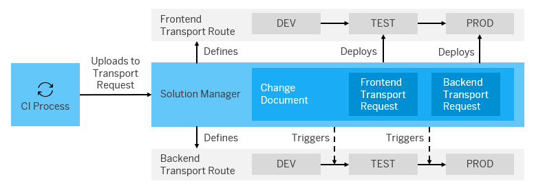

# Build and Deploy Hybrid Applications with SAP Solution Manager

Set up an agile development process with Jenkins CI, which automatically feeds changes into SAP Solution Manager.

## Prerequisites

* You have installed the Java Runtime Environment 8.
* You have installed Jenkins 2.60.3 or higher.
* You have set up Project “Piper”. See [README](https://github.com/SAP/jenkins-library/blob/master/README.md).
* You have installed SAP Solution Manager 7.2 SP6. See [README](https://github.com/SAP/devops-cm-client/blob/master/README.md).
* You have installed the Multi-Target Application (MTA) Archive Builder 1.0.6 or newer. See [SAP Development Tools](https://tools.hana.ondemand.com/#cloud). **Note:** This is only required if you don't use a Docker-based environment.
* You have installed Node.js including node and npm. See [Node.js](https://nodejs.org/en/download/).  **Note:** This is only required if you don't use a Docker-based environment.

## Context

In many SAP development scenarios, it is vital to synchronize both backend and frontend deliveries. These deliveries are typically an SAP UI5 application and an ABAP backend from which it is served. The SAP UI5 parts are often developed using agile practices and use Continuous Integration pipelines that automatically build, test, and deploy the application.

!!! note
    This scenario description is an example. You can apply the process to other scenarios and component sets, as well.

In this scenario, we want to show how an agile development process with Jenkins CI can automatically feed changes into SAP Solution Manager. In SAP Solution Manager, all parts of the application stack come together and can be subject to classic change and transport management.

The basic workflow is as follows:

1. The pipeline scans the Git commit messages for a line like `ChangeDocument : <changeDocumentId>`, and validates that the change is in the correct status `in development`. For more information, see [checkChangeInDevelopment](../../steps/checkChangeInDevelopment/). An example for the commit message looks as follows:

    ```
    Fix terminology in documentation

    Terminology must be consistent with official channels.
    ChangeDocument: <Your Change Document ID>
    ```

    **Note:** The blank line between message header and message description is mandatory.

1. To communicate with SAP Solution Manager, the pipeline uses credentials that must be stored on Jenkins using the credential ID `CM`. For more information, see [checkChangeInDevelopment](../../steps/checkChangeInDevelopment/).
1. The required transport request is created on the fly. **Note:** The change document can contain various components (for example, UI and backend components).
1. The changes of your development team trigger the Jenkins pipeline. It builds and validates the changes and attaches them to the respective transport request.
1. As soon as the development process is completed, the change document in SAP Solution Manager can be set to status `to be tested` and all components can be transported to the test system.


###### Hybrid Application Development Workflow

## Example

### Jenkinsfile

```groovy
@Library('piper-lib-os') _

node() {

  stage('prepare') {
    checkout scm
    setupCommonPipelineEnvironment script:this
    checkChangeInDevelopment script: this
  }

  stage('buildMta') {
    mtaBuild script: this
  }

  stage('uploadToTransportRequest') {
    transportRequestCreate script: this
    transportRequestUploadFile script:this
    transportRequestRelease script: this
  }

}
```

### Configuration (`.pipeline/config.yml`)

```yaml
#Steps Specific Configuration
general:
  changeManagement:
    endpoint: 'https://<backend-system>/sap/opu/odata/sap/AI_CRM_GW_CM_CI_SRV'
    credentialsId: 'CM'
    type: 'SOLMAN'
steps:
  mtaBuild:
    buildTarget: 'NEO'
  transportRequestCreate:
    developmentSystemId: '<value for developmentSystemId>'
  transportRequestUploadFile:
    applicationId: 'HCP'
```

### Parameters

For the detailed description of the relevant parameters, see:

* [checkChangeInDevelopment](../../steps/checkChangeInDevelopment/)
* [mtaBuild](../../steps/mtaBuild/)
* [transportRequestCreate](../../steps/transportRequestCreate/)
* [transportRequestUploadFile](../../steps/transportRequestUploadFile/)
* [transportRequestRelease](../../steps/transportRequestRelease/)
