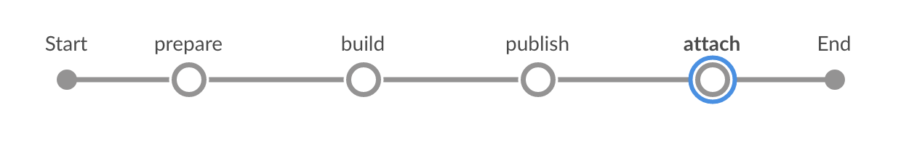

# Build SAPUI5 or SAP Fiori Applications and attaches it to a transport request on an ABAP system via RFC with Jenkins

Build an application based on SAPUI5 or SAP Fiori with Jenkins and attaches the build result to a transport request in an ABAP system.

## Prerequisites

* [Docker environment](https://docs.docker.com/get-started/)
* You have set up Project “Piper”. See [guided tour](https://sap.github.io/jenkins-library/guidedtour/)
* A transport request
* Docker image for attaching binaries available. Due to legal reasons there is no pre-build docker image. How to create the docker image is explained (here)[https://github.com/SAP/devops-docker-images/tree/master/node-rfc] 

### Project Prerequisites

This scenario requires additional files in your project and in the execution environment on your Jenkins instance.

On the project level, provide and adjust the following template:

| File Name | Description | Position |
|-----|-----|-----|
| [`mta.yaml`](https://github.com/SAP/jenkins-library/blob/master/documentation/docs/scenarios/rfc-upload/files/mta.yaml) | This file controls the behavior of the MTA toolset. | Place the `mta.yaml` file in your application root folder and adjust the values in brackets with your data. |

Depending on your setup more files are needed (e.g. for node builds `Gruntfile.js`, `package.json`)

## Context

This scenario combines various different steps to create a complete pipeline.

In this scenario, we want to show how to build an application based on SAPUI5 or SAP Fiori by using the multi-target application (MTA) concept and how to attach the build result to a tranpsort reuqest inside an ABAP system. This document comprises the [mtaBuild](https://sap.github.io/jenkins-library/steps/mtaBuild/) and the [transportRequestUploadFile](https://sap.github.io/jenkins-library/steps/transportRequestUploadFile/) steps.

The binary is not streamed to the endpoint. Instead the endpoint expects an URL pointing to the binary. Hence the binary must be published first. This can happen by uploading the binary to a blob store or by archiving the artifact on Jenkins. The corresponding URL needs to be provided when the artifact is attached to the transport request. The transport reuqest can be created on the fly (see [transportRequestCreate](https://sap.github.io/jenkins-library/steps/transportRequestCreate/)) or we can use an already existing transport request. In this case the transport request Id needs to be provided in the git commit history (see example below) or the transport request id needs to be provided inside the job (e.g. as a job parameter).

A git commit message containing the transportRequestId:

```
The headline

The body. The blank line above is mandatory (git standard).
TransportRequest: <YOUR TRANSPORT REQUEST ID>
```


###### Screenshot: Build and Deploy Process in Jenkins

## Example

### Jenkinsfile

Following the convention for pipeline definitions, use a `Jenkinsfile` which resides in the root directory of your development sources.

```groovy
@Library('piper-lib-os') _


pipeline {

    agent any

    stages {
        stage("prepare") {
            steps {
                deleteDir()
                checkout scm
                setupCommonPipelineEnvironment script: this
            }
        }

        stage('build') {
            // what needs to be done here depends on the project, maybe zipping the sources is sufficient
            mtaBuild script: this
        }

        stage('publish') {
            // uploads the binary into a blob store so that it can be attached to a transport request later
            sh "curl --upload-file <deployable> <BLOB_STORE/path/to/application>"

            // OR (in case there is no BLOB_STORE available)

            // this makes the artifact available on nexus. The url is:
            // <JENKINS_URL>/job/<JOB_NAME>/<BUILD_NUMBER>/artifact/<DEPLOYABLE>. Nota bene: this format is not an Jenkins API.
            // The build number can be retrieved during the build via ${currentBuild.number} 
            archiveArtifacts artifacts: <deployable>
        }

        // attaches the deployable to a transport request
        stage('attach') {
            transportRequestUploadFile script: this,
                                       transportRequestId: '<TRANSPORT_REQUEST_ID>', // can be omitted if present inside a git commit message
                                       applicationUrl: '<THE_URL_TO_THE_DEPLOYABLE_ACCORDING_TO_PUBLISH_STAGE>'
        }
    }
}
```

### Configuration (`.pipeline/config.yml`)

This is a basic configuration example, which is also located in the sources of the project.

```yaml
general:
  changeManagement:
    type: 'RFC'
    endpoint: 'the RFC endpoint' # e.g. example.com'
    credentialsId: 'RFC' # The id under which the credentials are provided on Jenkins, defaults to 'CM'
    rfc:
      developmentInstance: '01' # needs to be adjusted 
      developmentClient: '001' # needs to be adjusted
      docker:
        image: '<imageId>' # the image needs to be built on user side. The corresponding id needs to be provided here.
        options: []
        envVars: {}
        pullImage: true|false # true in case the image is provided by a company specific docker registry
    
steps:
    transportRequestUploadFile:
        codePage: <the code page>, # e.g. 'Cp1252'
        acceptUnixStyleLineEndings: true|false
        applicationName: '/your/application/name'
        applicationDescription: 'Application description'
        abapPackage: '/abap/package'
```

### Parameters

For the detailed description of the relevant parameters, see:

* [mtaBuild](https://sap.github.io/jenkins-library/steps/mtaBuild/)
* [transportRequestUploadFile](https://sap.github.io/jenkins-library/steps/transportRequestUploadFile/)
