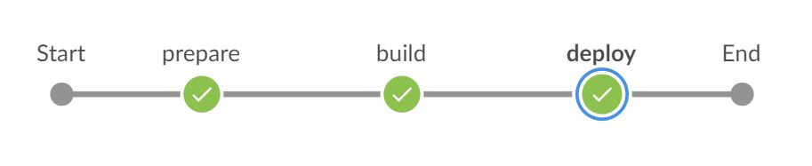

# Build and Deploy SAPUI5/SAP Fiori Applications on SAP Cloud Platform

Build an application based on SAPUI5 or SAP Fiori with Jenkins and deploy the build result into an SAP Cloud Platform account in the Cloud Foundry environment. Optionally, deploy the build result into the Neo environment.

## Prerequisites

* You have an account on SAP Cloud Platform in the Cloud Foundry environment. See [Accounts](https://help.sap.com/viewer/65de2977205c403bbc107264b8eccf4b/Cloud/en-US/8ed4a705efa0431b910056c0acdbf377.html).
* You have set up Project “Piper”. See [Guided Tour](https://sap.github.io/jenkins-library/guidedtour/).

### Project Prerequisites

This scenario requires additional files in your project and in the execution environment on your Jenkins instance.

On the project level, provide and adjust the following template:

| File Name | Description | Position |
|-----|-----|-----|
| [`mta.yaml`](https://github.com/SAP/jenkins-library/blob/master/documentation/docs/scenarios/ui5-sap-cp/files/mta.yaml) | This file controls the behavior of the [MTA toolset](https://sap.github.io/cloud-mta-build-tool/). | Place the `mta.yaml` file in your application root folder and replace the values in brackets with your data. |

## Context

This scenario combines various different steps to create a complete pipeline.

In this scenario, we want to show how to build an application based on SAPUI5 or SAP Fiori by using the multi-target application (MTA) concept, and how to deploy the build result into an SAP Cloud Platform account in the Cloud Foundry environment. This document comprises the [mtaBuild](../../../steps/mtaBuild/) and the [cloudFoundryDeploy](../../../steps/cloudFoundryDeploy/) steps.


###### Screenshot: Build and Deploy Process in Jenkins

## Example

### Jenkinsfile

Following the convention for pipeline definitions, use a `Jenkinsfile` which resides in the root directory of your development sources.

```groovy
@Library('piper-lib-os') _

fioriOnCloudPlatformPipeline script:this
```

[fioriOnCloudPlatformPipeline](https://sap.github.io/jenkins-library/steps/fioriOnCloudPlatformPipeline) is a so called _scenario step_ that wraps mainly the [MTA Build](https://sap.github.io/jenkins-library/steps/mtaBuild/) step and the [SAP Cloud Platform Deployment](https://sap.github.io/jenkins-library/steps/cloudFoundryDeploy/) step.

### Scenario Configuration

This is a basic configuration example, which also resides in the sources of the project. Edit `.pipeline/config.yml` below the root directory. The configuration corresponds to the steps wrapped in `fioriOnCloudPlatformPipeline`. For more information, see [mtaBuild](https://sap.github.io/jenkins-library/steps/mtaBuild/) and [cloudFoundryDeploy](https://sap.github.io/jenkins-library/steps/cloudFoundryDeploy/).

```yaml
steps:
  mtaBuild:
    platform: 'CF'
  cloudFoundryDeploy:
    cloudFoundry:
      apiEndpoint: 'your-cf-endpoint' # default: 'https://api.cf.eu10.hana.ondemand.com'
      org: 'your-org-id'
      space: 'your-space-id'
      credentialsId: 'CF-jenkins-credentials-id'
```

### Optional environment

Optionally, you can use [fioriOnCloudPlatformPipeline](https://sap.github.io/jenkins-library/steps/fioriOnCloudPlatformPipeline) to deploy your build result into the Neo environment. For more information, see [neoDeploy](https://sap.github.io/jenkins-library/steps/neoDeploy/).

```yaml
steps:
  mtaBuild:
    platform: 'NEO'
  neoDeploy:
    neo:
      credentialsId: 'NEO-jenkins-credentials-id'
      account: 'your-account-id'
      host: 'hana.ondemand.com'
```

### Parameters

For the detailed description of the relevant parameters, see:

* [fioriOnCloudPlatformPipeline](../../../steps/fioriOnCloudPlatformPipeline/)
* [mtaBuild](../../../steps/mtaBuild/)
* [cloudFoundryDeploy](../../../steps/cloudFoundryDeploy/)
* [neoDeploy](../../../steps/neoDeploy/)
