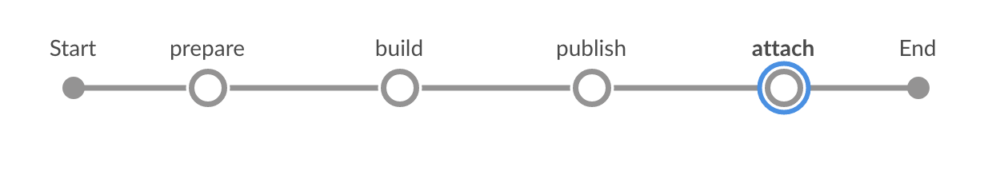

# Build an SAP Fiori Application and Attach It to a Transport Request on an ABAP System

Build an application based on SAPUI5 or SAP Fiori with Jenkins and attach the build result to a transport request in an SAP ABAP system.

Generally, you can choose between two technical ways to attach a binary to an ABAP transport request: We support uploads through RFC and through OData. Which option to use depends on the version of your ABAP system. For AS ABAP 7.50 SP08, 7.51 SP07, or 7.52 SP03 and newer, use the OData-based upload, for older versions, use the RFC-based upload.

## Prerequisites

* You have set up your [Docker environment](https://docs.docker.com/get-started/).
* You have set up project “Piper”. See [guided tour](../../../guidedtour/).
* You have a transport request. In General it is possible to create a transport request on the fly. But the example here is based on an already existing transport request.
* Depending on the version of the ABAP system: Docker image for attaching binaries to transport requests via RFC available. Due to legal reasons there is no pre-build docker image. How to create the docker image is explained [here](https://github.com/SAP/devops-docker-images/tree/master/node-rfc)

### Project Prerequisites

This scenario requires additional files in your project and in the execution environment on your Jenkins instance.

On the project level, provide and adjust the following template:

| File Name | Description | Position |
|-----|-----|-----|
| [`mta.yaml`](https://github.com/SAP/jenkins-library/blob/master/documentation/docs/scenarios/rfc-upload/files/mta.yaml) | This file controls the behavior of the MTA toolset. | Place the `mta.yaml` file in your application root folder and adjust the values in brackets with your data. |

Depending on the modules in your MTA, additional configuration files are required, e.g. `pom.xml`  or `package.json`.

## Context

This scenario combines various different steps to create a complete pipeline.

In this scenario, we want to show how to build an application based on SAPUI5 or SAP Fiori by using the multitarget application (MTA) concept and how to attach the build result to a transport request inside an ABAP system. This document comprises the [mtaBuild](../../../steps/mtaBuild/) and the [transportRequestUploadFile](../../../steps/transportRequestUploadFile/) steps.

In case of an RFC based upload the binary is not streamed to the ABAP endpoint. Instead an URL pointing to the binary needs to be provided. Hence the binary must be published first so that it can be accessed via HTTP. This can happen by uploading the binary to a blob store or by archiving the artifact on Jenkins. The corresponding URL needs to be provided when the artifact is attached to the transport request.

The transport request can be created on the fly (see [transportRequestCreate](../../../steps/transportRequestCreate/)) or we can use an already existing transport request. In case we use an already existing transport request Id the transport request Id needs to be provided in the git commit history (see example below) or the transport request Id needs to be provided inside the job (e.g. as a job parameter).

The transport request can be closed by the pipeline job (see [transportRequestRelease](../../../steps/transportRequestRelease/)).

This is an example of a Git commit message containing the transport request ID:

```
The headline

The body. The blank line above is mandatory (Git standard).
TransportRequest: <YOUR TRANSPORT REQUEST ID>
```

By default, the Git commits between the merge base with the base branch (default: `master`) and the current branch head are traversed.


###### Screenshot: Build and Deploy Process in Jenkins

## Examples

### Upload via RFC

#### Jenkinsfile

Following the convention for pipeline definitions, use a `Jenkinsfile`, which resides in the root directory of your development sources.

```groovy
@Library('piper-lib-os') _


pipeline {

    agent any

    stages {
        stage("prepare") {
            steps {
                deleteDir()
                checkout scm
                setupCommonPipelineEnvironment script: this
            }
        }

        stage('build') {
            steps {
                // It depends on your project, what needs to be done here. Maybe it's sufficient to zip the sources
                mtaBuild script: this
            }
        }

        stage('publish') {
            steps {
                // This uploads the binary into a blob store so that it can be attached to a transport request later
                sh "curl --upload-file <deployable> <BLOB_STORE/path/to/application>"

                // OR (in case there is no BLOB_STORE available)

                // This makes the artifact available on Nexus. The URL is the following:
                // <JENKINS_URL>/job/<JOB_NAME>/<BUILD_NUMBER>/artifact/<DEPLOYABLE>. Nota bene: this format is not an Jenkins API.
                // The build number can be retrieved during the build through ${currentBuild.number}
                archiveArtifacts artifacts: <deployable>
            }
        }

        // This attaches the deployable to a transport request
        stage('attach') {
            steps {
                transportRequestUploadFile script: this,
                                           transportRequestId: '<TRANSPORT_REQUEST_ID>', // This can be omitted if present inside a Git commit message
                                           applicationUrl: '<THE_URL_TO_THE_DEPLOYABLE_ACCORDING_TO_PUBLISH_STAGE>'
            }
        }
    }
}
```

#### Configuration (`.pipeline/config.yml`)

This is a basic configuration example, which is also located in the sources of the project.

```yaml
general:
  changeManagement:
    type: 'RFC'
    endpoint: 'the RFC endpoint' # e.g. example.com'
    credentialsId: 'RFC' # The ID under which the credentials are provided on Jenkins defaults to 'CM'
    rfc:
      developmentInstance: '01' # needs to be adjusted
      developmentClient: '001' # needs to be adjusted
      docker:
        image: '<imageId>' # the image needs to be built on user side. The corresponding ID needs to be provided here.
        options: []
        envVars: {}
        pullImage: true|false # true if the image is provided by a company-specific Docker registry

steps:
    transportRequestUploadFile:
        codePage: <the code page>, # e.g. 'Cp1252'
        acceptUnixStyleLineEndings: true|false
        applicationName: '/your/application/name'
        applicationDescription: 'Application description'
        abapPackage: '/abap/package'
```

### Upload via ODATA

#### Jenkinsfile

Following the convention for pipeline definitions, use a `Jenkinsfile`, which resides in the root directory of your development sources.

```groovy
@Library('piper-lib-os') _


pipeline {

    agent any

    stages {
        stage("prepare") {
            steps {
                deleteDir()
                checkout scm
                setupCommonPipelineEnvironment script: this
            }
        }

        stage('build') {
            steps {
                // It depends on your project, what needs to be done here. Maybe it's sufficient to zip the sources
                mtaBuild script: this
            }
        }

        // This attaches the deployable to a transport request,
        // if you have a prior call to mtaBuild, this step sets the deployable
        stage('attach') {
            steps {
                transportRequestUploadFile script: this,
                                           transportRequestId: '<TRANSPORT_REQUEST_ID>' // This can be omitted if present inside a Git commit message
            }
        }
    }
}
```

#### Configuration (`.pipeline/config.yml`)

This is a basic configuration example, which is also located in the sources of the project.

```yaml
general:
  changeManagement:
    type: 'CTS'
    endpoint: 'the ODATA endpoint' # e.g. 'http://example.org/sap/opu/odata/SAP/SCTS_CLOUD_API_ODATA_SRV/'
    credentialsId: 'CTS' # The ID under which the credentials are provided on Jenkins defaults to 'CM'
    clientOpts: '' # additional java options, e.g. '-Djavax.net.ssl.trustStore=/path/to/truststore.jks'
```

## Parameters

For the detailed description of the relevant parameters, see:

* [mtaBuild](https://sap.github.io/jenkins-library/steps/mtaBuild/)
* [transportRequestUploadFile](https://sap.github.io/jenkins-library/steps/transportRequestUploadFile/)
