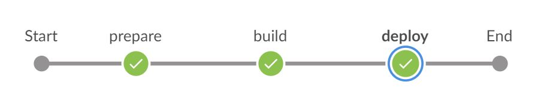

# Build and Deploy SAP Fiori Applications on SAP HANA Extended Application Services, Advanced Model

Build an application based on SAPUI5 or SAP Fiori with Jenkins and deploy the build result to SAP HANA extended application services, advanced model.

## Prerequisites

* [Docker environment](https://docs.docker.com/get-started/)
* All artifacts referenced during the build are available either on Service Market Place or via public repositories.
* You have set up project “Piper”. See [guided tour](https://sap.github.io/jenkins-library/guidedtour/).
* Docker image for xs deployment is locally available. Due to legal reasons, there is no pre-build Docker image. How to create the Docker image is explained [here][devops-docker-images-xs-deploy-readme].

### Project Prerequisites

This scenario requires additional files in your project and in the execution environment on your Jenkins instance.
For details see: [XSA developer quick start guide](https://help.sap.com/viewer/400066065a1b46cf91df0ab436404ddc/2.0.04/en-US/7f681c32c2a34735ad85e4ab403f8c26.html).

## Context

This scenario combines various different steps to create a complete pipeline.

In this scenario, we want to show how to build a multitarget application (MTA) and deploy the build result into an on-prem SAP HANA XS advances system. This document comprises the [mtaBuild](https://sap.github.io/jenkins-library/steps/mtaBuild/) and the [xsDeploy](https://sap.github.io/jenkins-library/steps/xsDeploy/) steps.



**Screenshot: Build and Deploy Process in Jenkins**

## Example

### Jenkinsfile

Following the convention for pipeline definitions, use a `Jenkinsfile`, which resides in the root directory of your development sources.

```groovy
@Library('piper-lib-os') _

pipeline {

    agent any

    stages {
        stage("prepare") {
            steps {
                deleteDir()
                checkout scm
                setupCommonPipelineEnvironment script: this
            }
        }
        stage('build') {
            steps {
                mtaBuild script: this
            }
        }
        stage('deploy') {
            steps {
                xsDeploy script: this
            }
        }
    }
}
```

### Configuration (`.pipeline/config.yml`)

This is a basic configuration example, which is also located in the sources of the project.

```yaml
steps:
  mtaBuild:
    buildTarget: 'XSA'
  xsDeploy:
    apiUrl: '<API_URL>' # e.g. 'https://example.org:30030'
    # credentialsId: 'XS' omitted, 'XS' is the default
    docker:
      dockerImage: '<ID_OF_THE_DOCKER_IMAGE' # for legal reasons no docker image is provided.
      # dockerPullImage: true # default: 'false'. Needs to be set to 'true' in case the image is served from a docker registry
    loginOpts: '' # during setup for non-productive builds we might set here. '--skip-ssl-validation'
    org: '<ORG_NAME>'
    space: '<SPACE>'

```

#### Configuration for the MTA Build

| Parameter        | Description    |
| -----------------|----------------|
| `buildTarget`    | The target platform to which the mtar can be deployed. In this case, the target platform is  `XSA`. |

#### Configuration for the Deployment to XSA

| Parameter          | Description |
| -------------------|-------------|
| `credentialsId` | The Jenkins credentials that contain user and password required for the deployment on SAP BTP.|
| `mode`          | DeployMode. See [stepDocu](../../../steps/xsDeploy) for more details. |
| `org`           | The org. See [stepDocu](../../../steps/xsDeploy) for more details. |
| `space`         | The space. See [stepDocu](../../../steps/xsDeploy) for more details. |

### Parameters

For the detailed description of the relevant parameters, see:

* [mtaBuild](https://sap.github.io/jenkins-library/steps/mtaBuild/)
* [xsDeploy](https://sap.github.io/jenkins-library/steps/xsDeploy/)

[devops-docker-images-xs-deploy-readme]: https://github.com/SAP/devops-docker-xs-cli/blob/master/README.md#how-to-build-it
