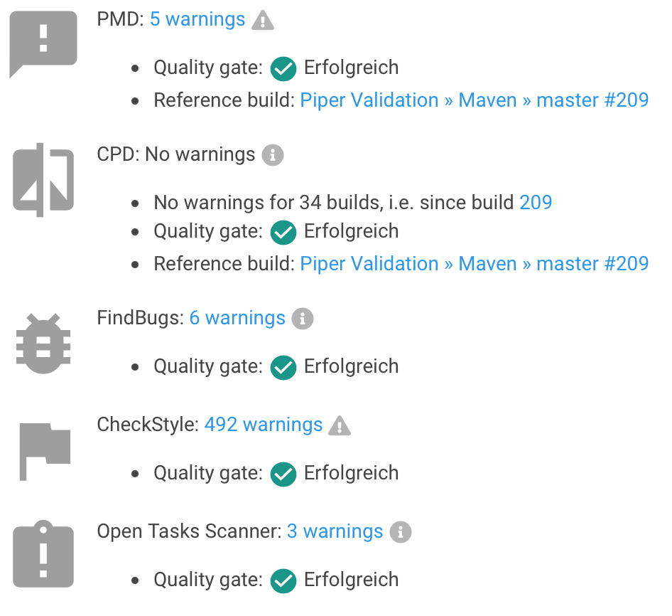

# ${docGenStepName}

## ${docGenDescription}

## Prerequisites

* **static check result files** - To use this step, there must be static check result files available.
* installed [warnings-ng](https://plugins.jenkins.io/warnings-ng/) plugin

## ${docGenParameters}

### aggregation

deprecated, do not use

### tasks

| parameter | mandatory | default | possible values |
| ----------|-----------|---------|-----------------|
| pattern | no | `'**/*.java'` |  |
| archive | no | `true` | `true`, `false` |
| high | no | `'FIXME'` |  |
| normal | no | `'TODO,REVISE,XXX'` |  |
| low | no |  |  |
| qualityGates | no | `[[threshold: 1, type: 'TOTAL_HIGH', unstable: false], [threshold: 1, type: 'TOTAL_ERROR', unstable: false]]` | see [QualityGates](#qualitygates) |

### pmd

| parameter | mandatory | default | possible values |
| ----------|-----------|---------|-----------------|
| pattern | no | `'**/target/pmd.xml'` |  |
| archive | no | `true` | `true`, `false` |
| qualityGates | no | `[[threshold: 1, type: 'TOTAL_HIGH', unstable: false], [threshold: 1, type: 'TOTAL_ERROR', unstable: false]]` | see [QualityGates](#qualitygates) |

### cpd

| parameter | mandatory | default | possible values |
| ----------|-----------|---------|-----------------|
| pattern | no | `'**/target/cpd.xml'` |  |
| archive | no | `true` | `true`, `false` |
| qualityGates | no | `[[threshold: 1, type: 'TOTAL_HIGH', unstable: false], [threshold: 1, type: 'TOTAL_ERROR', unstable: false]]` | see [QualityGates](#qualitygates) |

### findbugs

| parameter | mandatory | default | possible values |
| ----------|-----------|---------|-----------------|
| pattern | no | `'**/target/findbugsXml.xml, **/target/findbugs.xml'` |  |
| archive | no | `true` | true, false |
| qualityGates | no | `[[threshold: 1, type: 'TOTAL_HIGH', unstable: false], [threshold: 1, type: 'TOTAL_ERROR', unstable: false]]` | see [QualityGates](#qualitygates) |

### checkstyle

| parameter | mandatory | default | possible values |
| ----------|-----------|---------|-----------------|
| pattern | no | `'**/target/checkstyle-result.xml'` |  |
| archive | no | `true` | `true`, `false` |
| qualityGates | no | `[[threshold: 1, type: 'TOTAL_HIGH', unstable: false], [threshold: 1, type: 'TOTAL_ERROR', unstable: false]]` | see [QualityGates](#qualitygates) |

### eslint

| parameter | mandatory | default | possible values |
| ----------|-----------|---------|-----------------|
| pattern | no | `'**/eslint.jslint.xml'` |  |
| archive | no | `true` | `true`, `false` |
| qualityGates | no | `[[threshold: 1, type: 'TOTAL_HIGH', unstable: false], [threshold: 1, type: 'TOTAL_ERROR', unstable: false]]` | see [QualityGates](#qualitygates) |

### pylint

| parameter | mandatory | default | possible values |
| ----------|-----------|---------|-----------------|
| pattern | no | `'**/pylint.log'` |  |
| archive | no | `true` | `true`, `false` |
| qualityGates | no | `[[threshold: 1, type: 'TOTAL_HIGH', unstable: false], [threshold: 1, type: 'TOTAL_ERROR', unstable: false]]` | see [QualityGates](#qualitygates) |

## ${docGenConfiguration}

## ${docJenkinsPluginDependencies}

### QualityGates

It is possible to define quality gates to set the build result to `FAILURE` (not stop the build) on a certain count of findings. To achieve this, just define your quality gates as followed for the specific check tool:

```groovy
qualityGates: [
  [threshold: 1, type: 'TOTAL_HIGH', unstable: false],
  [threshold: 10, type: 'TOTAL_NORMAL', unstable: false],
  [threshold: 100, type: 'TOTAL_LOW', unstable: false],
  [threshold: 1000, type: 'TOTAL', unstable: false],
]
```

This way, the quality gate will fail on 1 high issue, 10 normal issues, 100 low issues or a total issue count of 1000.

The `qualityGates` parameter can be set for `tasks`, `pmd`, `cpd`, `findbugs`, `checkstyle`, `eslint` and `pylint`.

```groovy
checksPublishResults(
    tasks: true,
    pmd: [pattern: '**/target/pmd-results.xml', qualityGates: [[threshold: 101, type: 'TOTAL_LOW', unstable: true]]],
    cpd: [archive: false],
    archive: true
)
```

See also the [official plugin documentation](https://github.com/jenkinsci/warnings-ng-plugin/blob/master/doc/Documentation.md#quality-gate-configuration) for further information.



## Side effects

none

## Exceptions

none

## Example

```groovy
// publish java results from pmd, cpd, checkstyle & findbugs
checksPublishResults archive: true, pmd: true, cpd: true, findbugs: true, checkstyle: true
```

```groovy
// publish javascript results from ESLint
checksPublishResults archive: true, eslint: [pattern: '**/result-file-with-fancy-name.xml']
```

```groovy
// publish scala results from scalastyle
checksPublishResults archive: true, checkstyle: [pattern: '**/target/scalastyle-result.xml']
```

```groovy
// publish python results from pylint
checksPublishResults archive: true, pylint: [pattern: '**/target/pylint.log']
```
