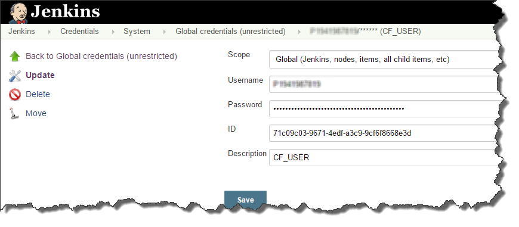

# ${docGenStepName}

## ${docGenDescription}

### Additional Hints

Deployment can be done

* in a standard way
* in a zero-downtime manner (using a [blue-green deployment approach](https://martinfowler.com/bliki/BlueGreenDeployment.html))

!!! note "Deployment supports multiple deployment tools"
    Currently the following are supported:

    * Standard `cf push` and [Bluemix blue-green plugin](https://github.com/bluemixgaragelondon/cf-blue-green-deploy#how-to-use)
    * [MTA CF CLI Plugin](https://github.com/cloudfoundry-incubator/multiapps-cli-plugin)

!!! note
    Due to [an incompatible change](https://github.com/cloudfoundry/cli/issues/1445) in the Cloud Foundry CLI, multiple buildpacks are not supported by this step.
    If your `application` contains a list of `buildpacks` instead of a single `buildpack`, this will be automatically re-written by the step when blue-green deployment is used.

!!! note
    Cloud Foundry supports the deployment of multiple applications using a single manifest file.
    This option is supported with project "Piper".
    In this case, define `appName: ''` since the app name for the individual applications has to be defined via the manifest.
    You can find details in the [Cloud Foundry Documentation](https://docs.cloudfoundry.org/devguide/deploy-apps/manifest.html#multi-apps)

## Prerequisites

* Cloud Foundry organization, space and deployment users are available
* Credentials for deployment have been configured in Jenkins with a dedicated Id

    

## ${docGenParameters}

## ${docGenConfiguration}

## ${docJenkinsPluginDependencies}

## Example

```groovy
cloudFoundryDeploy(
    script: script,
    deployType: 'blue-green',
    cloudFoundry: [apiEndpoint: 'https://test.server.com', appName:'cfAppName', credentialsId: 'cfCredentialsId', manifest: 'cfManifest', org: 'cfOrg', space: 'cfSpace'],
    deployTool: 'cf_native'
)
```
