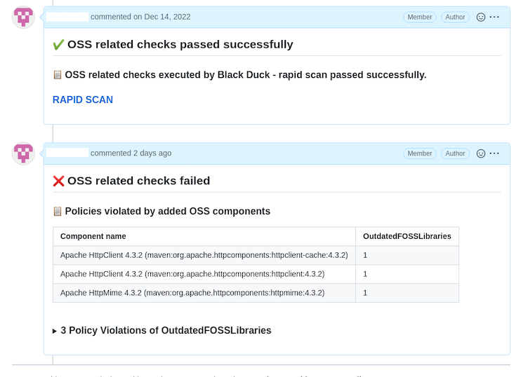

# ${docGenStepName}

## ${docGenDescription}

## Prerequisites

You need to store the API token for the Detect service as _'Secret text'_ credential in your Jenkins system.

## ${docJenkinsPluginDependencies}

## ${docGenParameters}

## ${docGenConfiguration}

## Rapid scan

In addition to the full scan, Black Duck also offers a faster and easier scan option, called <a href="https://documentation.blackduck.com/bundle/detect/page/runningdetect/rapidscan.html" target="_blank">Rapid Scan</a>.
Its main advantage is speed. In most cases, the scan is completed in less than 30 seconds. It doesn't save any information on the Black Duck side.
The result can be found in the pipeline console.

- **Note**
  By default, Black Duck scans run in 'FULL' mode. Although rapid scans do appropriate security checks for early detection of issues during daily developments, they are not sufficient for production deployment and releases: Only use 'FULL' scans for production deployment and releases.

### Running rapid scans on pull requests

If you have configured your orchestrator to detect pull requests, then the `detecExecuationScan` step in the Piper pipeline can recognize this and change the Black Duck scan mode from 'FULL' to 'RAPID'. This does not affect the usual branch scans.

- **Note**
  * This functionality is not applicable to the GPP (General Purpose Pipeline)
  * This can only be used for custom pipelines based on the Jenkins piper library

#### How to run rapid scans

1. Specify all the required parameters for the detectExecution step in .pipeline/config.yml
   Optionally you can specify `githubApi` and `githubToken` in the detectExecution step to get the result in the pull request comment.
   For example:

    ```
    ...
    steps:
      ...
      detectExecuteScan:
        serverUrl: 'https://sap-staging.app.blackduck.com/'
        detectTokenCredentialsId: 'JenkinsCredentialsIdForBlackDuckToken'
        projectName: 'projectNameInBlackDuckUI'
        version: 'v1.0'
        githubApiUrl: 'https://github.wdf.sap.corp/api/v3'
        githubToken: 'JenkinsCredentialsIdForGithub'
      ...
    ...
    ```

2. Enable detecExecuationScan in the orchestrator.
  For example:

    ```
    @Library('piper-lib') _
    @Library('piper-lib-os') __

    node {
      stage('Init') {
        checkout scm
        setupPipelineEnvironment script: this
      }
      stage('detectExecuteScan') {
         detectExecuteScan script: this
      }
      ...
    }
    ```

3. To run the rapid scan, open a pull request with your changes to the main branch.

#### Result of the rapid scan

If you provide `githubApi` and `githubToken`, then the pipeline adds the scan result to the comment of the opened pull request.


