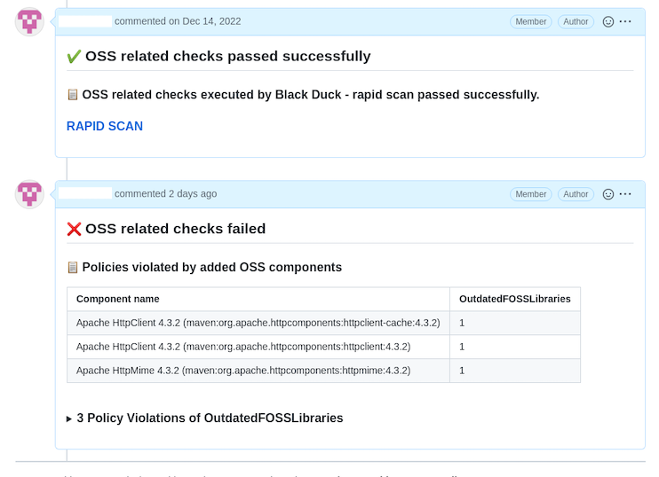

# ${docGenStepName}

## ${docGenDescription}

## Prerequisites

You need to store the API token for the Detect service as _'Secret text'_ credential in your Jenkins system.

## Scan Types & Configuration

| Scan Type | Description | Parameter | Default |
|---|---|---|---|
| **Signature Scan** | Scans file signatures to identify open-source components by matching against the BlackDuck KnowledgeBase. | `scanners: [signature]` | ✅ Enabled by default |
| **Source Scan** | Scans actual source code content to find code-level matches beyond what signature scanning detects. | `scanners: [source]` | ❌ Disabled by default |
| **Container Image Scan** | Downloads and scans Docker container images for vulnerabilities in OS packages and libraries. | `scanContainerDistro` or `containerScan: true` | ❌ Disabled by default |

## Scan Modes

| Mode | When it activates | Behavior |
|---|---|---|
| **FULL** (default) | Normal branch builds | Complete scan. Results are persisted on the BlackDuck server. Required for production deployments and releases. |
| **RAPID** | Automatically on Pull Requests | Fast scan (~30 seconds). No data saved on BlackDuck server. Suitable for early detection during development, but not for production. |

> **Note:** Rapid scan mode is not a separate scan type — it is a mode modifier that applies to whichever scan types are configured. The switch from FULL to RAPID happens automatically when the orchestrator detects a Pull Request.

## Combination Rules

### Rule 1: Signature + Source scan
Signature and source scanners run together within a **single** `detect.sh` invocation (the main scan).

```yaml
steps:
  detectExecuteScan:
    serverUrl: 'https://your-blackduck-server.com/'
    scanners:
      - signature
      - source
```

### Rule 2: Main scan + Container image scan (via `scanContainerDistro`)
The main scan (signature **or** source) runs first, then container image scans run separately — one `detect.sh` execution per image.

```yaml
steps:
  detectExecuteScan:
    serverUrl: 'https://your-blackduck-server.com/'
    scanContainerDistro: 'ubuntu'
```

### Rule 3: Container image scan only (via `containerScan: true`)
The main scan (signature/source) is **skipped entirely**. Only container image scans execute.

```yaml
steps:
  detectExecuteScan:
    serverUrl: 'https://your-blackduck-server.com/'
    containerScan: true
```

### Rule 4: Rapid scan on Pull Requests
No additional configuration required. When a Pull Request is detected by the orchestrator, the scan mode automatically switches to RAPID. Optionally provide GitHub credentials to post results as a PR comment.

> **Note:** Rapid scan functionality is not applicable to GPP (General Purpose Pipeline). It can only be used with custom pipelines based on the Jenkins Piper library.

#### How to run rapid scans

1. Specify all the required parameters for the `detectExecuteScan` step in `.pipeline/config.yml`. Optionally specify `githubApiUrl` and `githubToken` to get the result posted as a pull request comment.

    ```yaml
    steps:
      detectExecuteScan:
        serverUrl: 'https://sap-staging.app.blackduck.com/'
        detectTokenCredentialsId: 'JenkinsCredentialsIdForBlackDuckToken'
        projectName: 'projectNameInBlackDuckUI'
        version: 'v1.0'
        githubApiUrl: 'https://github.wdf.sap.corp/api/v3'
        githubToken: 'JenkinsCredentialsIdForGithub'
    ```

2. Enable `detectExecuteScan` in your chosen orchestrator via config

3. To run the rapid scan, open a pull request with your changes to the main branch.

#### Result of the rapid scan

If you provide `githubApiUrl` and `githubToken`, the pipeline adds the scan result to the pull request comment.



## Summary Table

| Configuration | Main Scan (Signature/Source) | Container Image Scan | Mode | Total Executions |
|---|:---:|:---:|:---:|:---:|
| Default | ✅ Signature | ❌ | FULL | 1 |
| `scanners: [signature, source]` | ✅ Signature + Source | ❌ | FULL | 1 |
| `scanContainerDistro: ubuntu` | ✅ Signature (default) | ✅ | FULL | 1 + N |
| `scanners: [signature, source]` + `scanContainerDistro` | ✅ Signature + Source | ✅ | FULL | 1 + N |
| `containerScan: true` | ❌ Skipped | ✅ | FULL | N |
| Any of the above + Pull Request detected | Same as above | Same as above | RAPID | Same as above |

*N = number of container images in `imageNameTags`*

## ${docJenkinsPluginDependencies}

## ${docGenParameters}

## ${docGenConfiguration}
