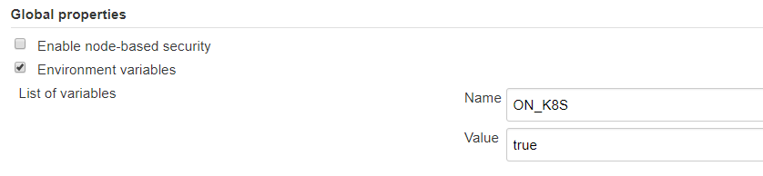

# ${docGenStepName}

## ${docGenDescription}

## Prerequisites

* The Jenkins should be running on kubernetes.
* An environment variable `ON_K8S` should be created on Jenkins and initialized to `true`. This could for example be done via _Jenkins_ - _Manage Jenkins_ - _Configure System_ - _Global properties_ - _Environment variables_



## ${docGenParameters}

## ${docGenConfiguration}

## ${docJenkinsPluginDependencies}

## Side effects

none

## Exceptions

none

## Example 1: Run a closure in a single container pod

```sh
# set environment variable
export ON_K8S=true"
```

```groovy
dockerExecuteOnKubernetes(script: script, dockerImage: 'maven:3.5-jdk-7'){
    sh "mvn clean install"
}
```

In the above example, a pod will be created with a docker container of image `maven:3.5-jdk-7`. The closure will be then executed inside the container.

## Example 2: Run a closure in a multi-container pod

```sh
# set environment variable
export ON_K8S=true"
```

```groovy
dockerExecuteOnKubernetes(script: script, containerMap: ['maven:3.5-jdk-8-alpine': 'maven', 'ppiper/cf-cli:6': 'cfcli']){
    container('maven'){
        sh "mvn clean install"
    }
    container('cfcli'){
        sh "cf plugins"
    }
}
```

In the above example, a pod will be created with multiple Docker containers that are passed as a `containerMap`. The containers can be chosen for executing by referring their labels as shown in the example.

## Example 3: Running a closure in a dedicated container of a multi-container pod

```sh
# set environment variable
export ON_K8S=true"
```

```groovy
dockerExecuteOnKubernetes(
  script: script,
  containerCommands: ['selenium/standalone-chrome': ''],
  containerMap: ['maven:3.5-jdk-8-alpine': 'maven', 'selenium/standalone-chrome': 'selenium'],
  containerName: 'maven',
  containerPortMappings: ['selenium/standalone-chrome': [[containerPort: 4444, hostPort: 4444]]],
  containerWorkspaces: ['selenium/standalone-chrome': '']
){
  echo "Executing inside a Kubernetes Pod inside 'maven' container to run Selenium tests"
  sh "mvn clean install"
}
```
