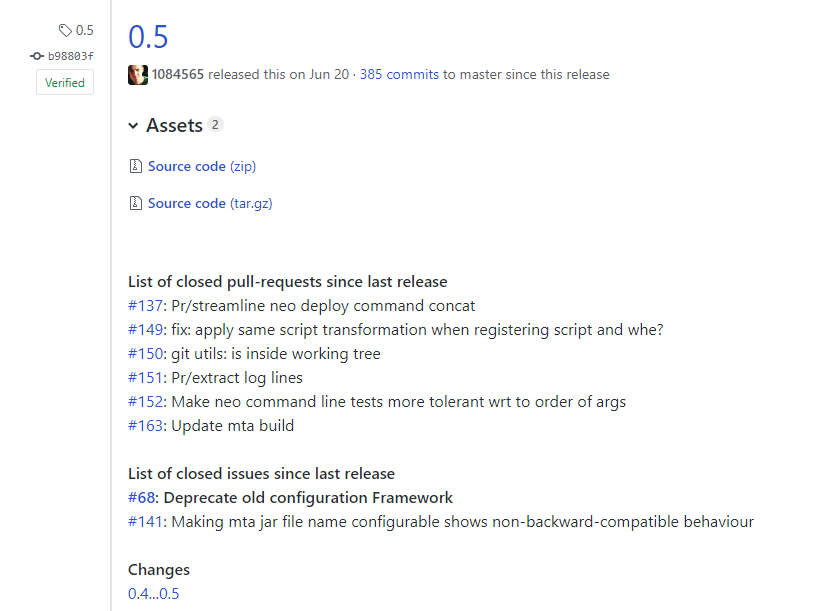

# githubPublishRelease

## Description
This step creates a tag in your GitHub repository together with a release.

The release can be filled with text plus additional information like:

* Closed pull request since last release
* Closed issues since last release
* link to delta information showing all commits since last release

The result looks like



## Prerequisites
You need to create a personal access token within GitHub and add this to the Jenkins credentials store.

Please see [GitHub documentation for details about creating the personal access token](https://help.github.com/articles/creating-a-personal-access-token-for-the-command-line/).

## Example

Usage of pipeline step:

```groovy
githubPublishRelease script: this, releaseBodyHeader: "**This is the latest success!**<br />"
```

## Parameters

| parameter | mandatory | default | possible values |
| ----------|-----------|---------|-----------------|
|script|yes|||
|addClosedIssues|no|`false`||
|addDeltaToLastRelease|no|`false`||
|customFilterExtension|no|``||
|excludeLabels|no|<ul><li>`wontfix`</li><li>`duplicate`</li></ul>||
|githubApiUrl|no|`//https://api.github.com`||
|githubOrg|yes|`script.commonPipelineEnvironment.getGitFolder()`||
|githubRepo|yes|`script.commonPipelineEnvironment.getGitRepo()`||
|githubServerUrl|no|`https://github.com`||
|githubTokenCredentialsId|yes|||
|releaseBodyHeader|no|||
|version|yes|`script.commonPipelineEnvironment.getArtifactVersion()`||

### Details:

* `script` defines the global script environment of the Jenkinsfile run. Typically `this` is passed to this parameter. This allows the function to access the [`commonPipelineEnvironment`](commonPipelineEnvironment.md) for storing the measured duration.
* All GitHub related properties allow you to overwrite the default behavior of identifying e.g. GitHub organization, GitHub repository.
* `version` defines the version number which will be written as tag as well as release name
* By defining the `releaseBodyHeader` you can specify the content which will appear for the release
* If you set `addClosedIssues` to `true`, a list of all closed issues and merged pull-requests since the last release will added below the `releaseBodyHeader`
* If you set `addDeltaToLastRelease` to `true`, a link will be added to the relese information that brings up all commits since the last release.
* By passing the parameter `customFilterExtension` it is possible to pass additional filter criteria for retrieving closed issues since the last release. Additional criteria could be for example specific `label`, or `filter` according to [GitHub API documentation](https://developer.github.com/v3/issues/).
* It is possible to exclude issues with dedicated labels using parameter `excludeLabels`. Usage is like `excludeLabels: ['label1', 'label2']`


## Step configuration

We recommend to define values of step parameters via [config.yml file](../configuration.md).

In following sections the configuration is possible:

| parameter | general | step | stage |
| ----------|-----------|---------|-----------------|
|script||||
|addClosedIssues||X|X|
|addDeltaToLastRelease||X|X|
|customFilterExtension||X|X|
|excludeLabels||X|X|
|githubApiUrl|X|X|X|
|githubOrg||X|X|
|githubRepo||X|X|
|githubServerUrl|X|X|X|
|githubTokenCredentialsId|X|X|X|
|releaseBodyHeader||X|X|
|version||X|X|
