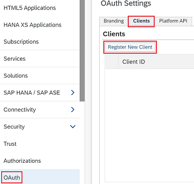

# ${docGenStepName}

!!! warning "Deprecation notice"
This step will soon be deprecated!

## ${docGenDescription}

## Prerequisites

* **SAP BTP account** - the account to where the application is deployed. To deploy MTA (`deployMode: mta`) an over existing _Java_ application, free _Java Quota_ of at least 1 is required, which means that this will not work on trial accounts.
* **SAP BTP user for deployment** - a user with deployment permissions in the given account.
* **Jenkins credentials for deployment** - must be configured in Jenkins credentials with a dedicated Id.


* **Neo Java Web SDK 3.39.10 or compatible version** - can be downloaded from [Maven Central](http://central.maven.org/maven2/com/sap/cloud/neo-java-web-sdk/). This step is capable of triggering the neo deploy tool provided inside a docker image. We provide docker image `ppiper/neo-cli`. `neo.sh` needs to be contained in path, e.g by adding a symbolic link to `/usr/local/bin`.

* **Java 8 or compatible version** - needed by the _Neo-Java-Web-SDK_. Java environment needs to be properly configured (JAVA_HOME, java exectutable contained in path).

## ${docGenParameters}

## ${docGenConfiguration}

## ${docJenkinsPluginDependencies}

## Side effects

none

## Exceptions

* `Exception`:
  * If `source` is not provided.
  * If `propertiesFile` is not provided (when using `'WAR_PROPERTIESFILE'` deployment mode).
  * If `application` is not provided (when using `'WAR_PARAMS'` deployment mode).
  * If `runtime` is not provided (when using `'WAR_PARAMS'` deployment mode).
  * If `runtimeVersion` is not provided (when using `'WAR_PARAMS'` deployment mode).
* `AbortException`:
  * If neo-java-web-sdk is not properly installed.
* `CredentialNotFoundException`:
  * If the credentials cannot be resolved.

## Example

```groovy
neoDeploy script: this, source: 'path/to/archiveFile.mtar', neo: [credentialsId: 'my-credentials-id', host: hana.example.org]
```

Example configuration:

```yaml
steps:
  <...>
  neoDeploy:
    deployMode: mta
    neo:
      account: <myDeployAccount>
      host: hana.example.org
```

## Example for invalidating the cache

Set the parameter `invalidateCache` to `true` to clean up the cache of an SAP Fiori launchpad site by refreshing the content of HTML5 applications deployed in it.

**Note:** This section is only applicable for HTML5 applications accessed through an SAP Fiori launchpad site.

Setting this parameter to `true` requires additional configuration:

### Create an OAuth credential

1. In your subaccount, choose **OAuth**.

    

2. In the **Subscription** field, select the portal landscape to which you would like to subscribe, for example, `portal/nwc` or `portal/sandbox`.

    

3. From the drop-down menu in the **Authorization Grant** field, choose **Client Credentials**.

4. In the **Secret** field, enter a user-defined password and save your changes.

5. In Jenkins, create new username/password credentials. As username, use the client ID and as password, use the client secret.

### Configure the site ID

When you're logged in to the portal service, you can retrieve the site ID. Either configure it in your configuration file or set the site as default through the **Site Directory** tile.
If you don't set it as default, configure the parameter `siteId` as follows in your configuration file:

```yaml
steps:
  <...>
  neoDeploy:
    neo:
      account: <myDeployAccount>
      host: hana.example.org
      credentialsId: 'my-credentials-id'
      invalidateCache: true
      portalLandscape: "cloudnwcportal"
      oauthCredentialId: <OAUTH_CREDENTIAL_ID>
      siteId: <PORTAL_SITE_ID> # not required, if the default site is already set in the portal service (SAP BTP)
```
